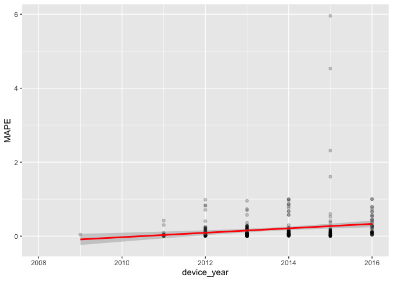
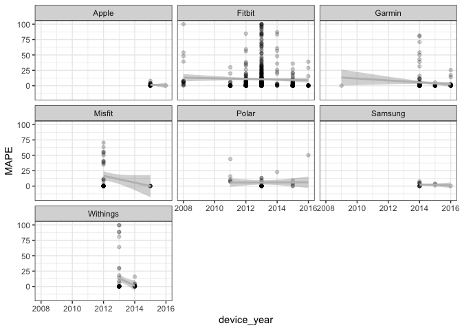
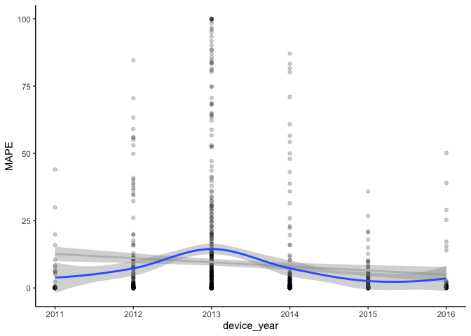
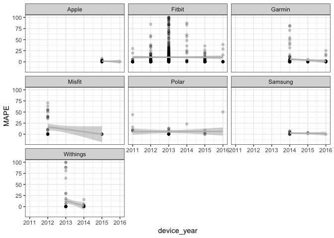
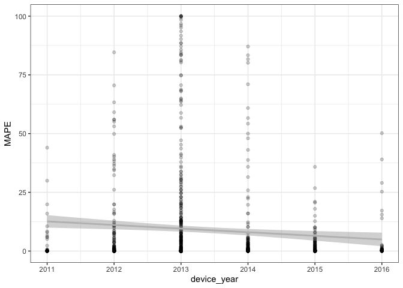
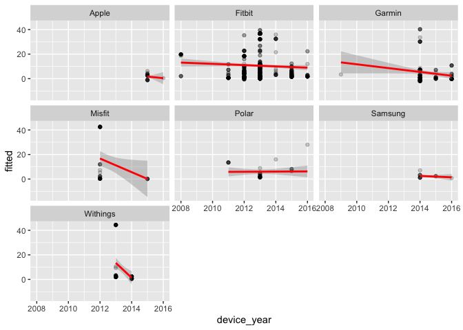
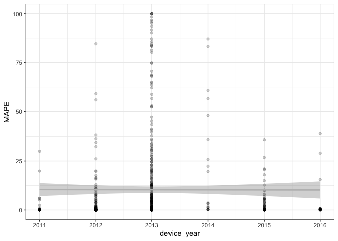
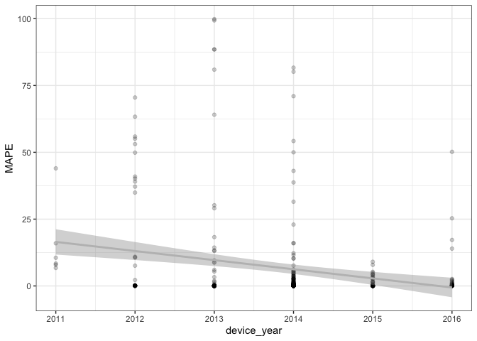

### Packages


```r
library(tidyverse)
```

```
## ── Attaching packages ─────────────────────────────────────── tidyverse 1.3.2 ──
## ✔ ggplot2 3.4.0      ✔ purrr   0.3.5 
## ✔ tibble  3.1.8      ✔ dplyr   1.0.10
## ✔ tidyr   1.2.1      ✔ stringr 1.4.1 
## ✔ readr   2.1.3      ✔ forcats 0.5.2 
## ── Conflicts ────────────────────────────────────────── tidyverse_conflicts() ──
## ✖ dplyr::filter() masks stats::filter()
## ✖ dplyr::lag()    masks stats::lag()
```

```r
library(readxl)
library(broom)
library(broom.mixed)
library(lme4)
```

```
## Loading required package: Matrix
## 
## Attaching package: 'Matrix'
## 
## The following objects are masked from 'package:tidyr':
## 
##     expand, pack, unpack
```

```r
library(rstatix)
```

```
## 
## Attaching package: 'rstatix'
## 
## The following object is masked from 'package:stats':
## 
##     filter
```

```r
library(gtsummary)
```

```
## #Uighur
```

```r
library(knitr)
```

### Reading in data


```r
validity1 <- read_csv("wearable_review_data_validity.csv")
```

```
## Rows: 1672 Columns: 107
## ── Column specification ────────────────────────────────────────────────────────
## Delimiter: ","
## chr (62): Author, Substudy, Setting, Measured, Measure_Unit, Brand, Device, ...
## dbl (44): X1, Year, device_year, age_SD, weight_SD, height_SD, BMI_SD, actua...
## lgl  (1): n_15pctofcrit
## 
## ℹ Use `spec()` to retrieve the full column specification for this data.
## ℹ Specify the column types or set `show_col_types = FALSE` to quiet this message.
```

```r
validity <- select(validity1, 1:37, MPE, MAPE)

write_csv(validity, "validity_over_time.csv")

validity <- validity %>% 
  mutate(MAPE = ifelse(is.na(MAPE),
                            abs(MPE*100),
                            MAPE))
```

### Reading in data


```r
glimpse(validity)
```

```
## Rows: 1,672
## Columns: 39
## $ X1                 <dbl> 1, 2, 3, 4, 5, 6, 7, 8, 9, 10, 11, 12, 13, 14, 15, …
## $ Author             <chr> "Dooley", "Dooley", "Dooley", "Boudreaux", "Boudrea…
## $ Year               <dbl> 2017, 2017, 2017, 2018, 2018, 2018, 2017, 2017, 201…
## $ Substudy           <chr> "-", "-", "-", "-", "-", "-", "-", "-", "-", "-", "…
## $ Setting            <chr> "Controlled", "Controlled", "Controlled", "Controll…
## $ Measured           <chr> "HR", "HR", "HR", "HR", "HR", "HR", "SC", "SC", "SC…
## $ Measure_Unit       <chr> "bpm", "bpm", "bpm", "bpm", "bpm", "bpm", "steps/10…
## $ Brand              <chr> "Apple", "Apple", "Apple", "Apple", "Apple", "Apple…
## $ Device             <chr> "Watch", "Watch", "Watch", "Watch Series 2", "Watch…
## $ device_name        <chr> "Apple Watch", "Apple Watch", "Apple Watch", "Apple…
## $ device_year        <dbl> 2015, 2015, 2015, 2016, 2016, 2016, 2015, 2015, 201…
## $ Wear_Location      <chr> "Wrist", "Wrist", "Wrist", "Wrist", "Wrist", "Wrist…
## $ Wear_Info          <chr> "wrist, random", "wrist, random", "wrist, random", …
## $ Type               <chr> "full-text", "full-text", "full-text", "full-text",…
## $ `Good?`            <chr> "y", "y", "y", "y", "y", "y", "y", "y", "y", "y", "…
## $ Criterion_Measure  <chr> "Heart rate sensor chest strap (Polar T31)", "Heart…
## $ Criterion_Type     <chr> "chest strap", "chest strap", "chest strap", "ECG",…
## $ Wear_Info_crit     <chr> "chest", "chest", "chest", "upper torso", "upper to…
## $ Wear_Location_crit <chr> "Torso", "Torso", "Torso", "Torso", "Torso", "Torso…
## $ population_n       <chr> "62", "62", "62", "50", "50", "50", "31", "31", "31…
## $ population_m       <chr> "26", "26", "26", "22", "22", "22", "16", "16", "16…
## $ population_f       <chr> "36", "36", "36", "28", "28", "28", "15", "15", "15…
## $ population         <chr> "healthy adults", "healthy adults", "healthy adults…
## $ age_code           <chr> "A", "A", "A", "A", "A", "A", "A", "A", "A", "A", "…
## $ health_code        <chr> "H", "H", "H", "H", "H", "H", "H", "H", "H", "H", "…
## $ age                <chr> "22.55", "22.55", "22.55", "22.71", "22.71", "22.71…
## $ age_SD             <dbl> 4.34, 4.34, 4.34, 2.99, 2.99, 2.99, 12.00, 12.00, 1…
## $ weight             <chr> "72.02", "72.02", "72.02", "67.79", "67.79", "67.79…
## $ weight_SD          <dbl> 18.99, 18.99, 18.99, 14.01, 14.01, 14.01, NA, NA, N…
## $ height             <chr> "170", "170", "170", "162.71", "162.71", "162.71", …
## $ height_SD          <dbl> 11.00, 11.00, 11.00, 5.79, 5.79, 5.79, NA, NA, NA, …
## $ BMI                <chr> "24.6", "24.6", "24.6", "25.83", "25.83", "25.83", …
## $ BMI_SD             <dbl> 4.77, 4.77, 4.77, 4.83, 4.83, 4.83, 2.40, 2.40, 2.4…
## $ location           <chr> "TX, USA", "TX, USA", "TX, USA", "LA, USA", "LA, US…
## $ activity_type      <chr> "Rest: Seated", "Rest: Seated", "Rest: Seated", "Re…
## $ test_type          <chr> "Rest", "Rest", "Rest", "Rest", "Rest", "Activity",…
## $ activity_type_code <chr> "Se", "Se", "Se", "Se", "Se", "Mi", "At", "At", "At…
## $ MPE                <dbl> 0.007190265, 0.001096041, -0.005327335, NA, NA, NA,…
## $ MAPE               <dbl> 0.0276, 0.0163, 0.0114, 0.0121, 0.0144, 0.0299, 0.0…
```

### Filtering the data for SC


```r
validity <- subset(validity, Measured != "EE" & Measured != "HR")
```

### Removing Xiaomi and Mio (only one year of devices)


```r
validity <- subset(validity, Brand != "Xiaomi")

validity <- subset(validity, Brand != "Mio")
```

### Removing years prior to 2011


```r
validity <- subset(validity, device_year != "2008" & device_year != "2009")
```


```r
clean_data <- validity %>% drop_na(MAPE)

### Create study_year variable

clean_data$study_year <- str_c(clean_data$Author, clean_data$Year, sep = "_")
length(clean_data$study_year)
```

```
## [1] 944
```


### Number of SC validity tests conducted within each brand


```r
table(clean_data$Brand)
```

```
## 
##    Apple   Fitbit   Garmin   Misfit    Polar  Samsung Withings 
##       22      601      148       41       41       15       76
```

There are 7 different brands of commercial wearable devices included in this study. They are: Apple (31 validity tests), Fitbit (673 validity tests), Garmin (169 validity tests), Misfit (42 validity tests), Polar (42 validity tests), Samsung (15 validity tests) and Withings (84 validity tests).

### Number of SC validity tests conducted within each device type per Brand


```r
table(clean_data$device_name)
```

```
## 
##             Apple Watch    Apple Watch Series 2           Fitbit Charge 
##                      21                       1                      20 
##         Fitbit Charge 2        Fitbit Charge HR             Fitbit Flex 
##                      25                      66                      98 
##            Fitbit Force              Fitbit One            Fitbit Surge 
##                       5                     145                      18 
##            Fitbit Ultra              Fitbit Zip   Garmin Forerunner 235 
##                      37                     187                       2 
## Garmin Forerunner 735XT Garmin Forerunner 920XT       Garmin Vivoactive 
##                       3                       6                       6 
##          Garmin Vivofit        Garmin Vivofit 2        Garmin Vivofit 3 
##                      77                       3                       6 
##        Garmin Vivosmart     Garmin Vivosmart HR    Garmin Vivosmart HR+ 
##                      14                       8                      23 
##            Misfit Flash            Misfit Shine              Polar A360 
##                       6                      35                       6 
##            Polar Active              Polar Loop              Polar M600 
##                       6                      27                       1 
##              Polar V800          Samsung Gear 2          Samsung Gear S 
##                       1                       4                       7 
##         Samsung Gear S2         Samsung Gear S3       Withings Pulse O2 
##                       3                       1                      47 
##       Withings Pulse Ox 
##                      29
```

There are multiple of device types within each brand that were tested for step count validity. Apple has two device types tested: Apple Watch (30 validity tests) and Apple Watch Series 2 (1 validity test). Fitbit has 11 device types: Fitbit (3), Fitbit Charge (21), Fitbit Charge 2 (30), Fitbit Charge HR (76), Fitbit Classic (17), Fitbit Flex (109), Fitbit Force (6), Fitbit One (160), Fitbit Surge (18), Fitbit Ultra (39), Fitbit Zip (194). Garmin has 11 device types: Garmin Forerunner 235 (2), Garmin Forerunner 405CX (1), Garmin Forerunner 735XT (3), Garmin Forerunner 920XT (6), Garmin Vivoactive (6), Garmin Vivofit (81), Garmin Vivofit 2 (11), Garmin Vivofit 3 (6), Garmin Vivosmart (14), Garmin Vivosmart HR (13) and Garmin Vivosmart HR+ (26). Misfit has two device types: Misfit Flash (6) and Misfit Shine (36). Polar has 6 device types: Polar A300 (1), Polar A360 (6), Polar Active (6), Polar Loop (27), Polar M600 (1) and Polar V800 (1). Samsung has 4 device types: Samsung Gear 2 (4), Samsung Gear S (7), Samsung Gear S2 (3) and Samsung Gear S3 (1). Withings has 2 device types: Withings Pulse O2 (50) and Withings Pulse Ox (34).


### Number of devices tested for step count per brand and year of release


```r
brand_time <- table(clean_data$Brand, clean_data$device_year)
kable(brand_time)
```


|         | 2011| 2012| 2013| 2014| 2015| 2016|
|:--------|----:|----:|----:|----:|----:|----:|
|Apple    |    0|    0|    0|    0|   21|    1|
|Fitbit   |   37|  145|  290|   20|   84|   25|
|Garmin   |    0|    0|    0|   97|   19|   32|
|Misfit   |    0|   35|    0|    0|    6|    0|
|Polar    |    6|    0|   27|    1|    6|    1|
|Samsung  |    0|    0|    0|   11|    3|    1|
|Withings |    0|    0|   47|   29|    0|    0|

```r
histo_device_year_Brand <- ggplot(data = clean_data, aes(device_year)) +
        geom_histogram() +
        facet_wrap(~ Brand)

plot(histo_device_year_Brand)
```

```
## `stat_bin()` using `bins = 30`. Pick better value with `binwidth`.
```

<!-- -->

### Summary of Mean Absolute Percentage Error for SC of all brands


```r
summary(clean_data$MAPE)
```

```
##      Min.   1st Qu.    Median      Mean   3rd Qu.      Max. 
##   0.00000   0.06628   0.57450   8.98760   6.50774 100.00000
```

```r
mape_time <- clean_data %>%
    group_by(device_year) %>%
    get_summary_stats(MAPE, type = "mean_sd") %>%
    arrange(device_year)
kable(mape_time)
```


| device_year|variable |   n|   mean|     sd|
|-----------:|:--------|---:|------:|------:|
|        2011|MAPE     |  43|  3.861|  8.776|
|        2012|MAPE     | 180|  7.290| 15.312|
|        2013|MAPE     | 364| 14.495| 25.513|
|        2014|MAPE     | 158|  7.304| 17.519|
|        2015|MAPE     | 139|  2.595|  5.231|
|        2016|MAPE     |  60|  3.587|  9.665|

```r
mape_time_brand <- clean_data %>%
    group_by(Brand, device_year) %>%
    get_summary_stats(MAPE, type = "mean_sd") %>%
    arrange(Brand, device_year)
kable(mape_time_brand)
```


|Brand    | device_year|variable |   n|   mean|     sd|
|:--------|-----------:|:--------|---:|------:|------:|
|Apple    |        2015|MAPE     |  21|  1.678|  2.129|
|Apple    |        2016|MAPE     |   1|  0.420|     NA|
|Fitbit   |        2011|MAPE     |  37|  1.958|  5.901|
|Fitbit   |        2012|MAPE     | 145|  5.020| 11.668|
|Fitbit   |        2013|MAPE     | 290| 15.816| 25.714|
|Fitbit   |        2014|MAPE     |  20| 22.754| 29.263|
|Fitbit   |        2015|MAPE     |  84|  3.378|  6.407|
|Fitbit   |        2016|MAPE     |  25|  3.592|  9.753|
|Garmin   |        2014|MAPE     |  97|  6.290| 16.190|
|Garmin   |        2015|MAPE     |  19|  0.620|  1.317|
|Garmin   |        2016|MAPE     |  32|  2.332|  5.639|
|Misfit   |        2012|MAPE     |  35| 16.691| 23.339|
|Misfit   |        2015|MAPE     |   6|  0.101|  0.053|
|Polar    |        2011|MAPE     |   6| 15.594| 14.294|
|Polar    |        2013|MAPE     |  27|  2.166|  4.085|
|Polar    |        2014|MAPE     |   1| 22.959|     NA|
|Polar    |        2015|MAPE     |   6|  3.490|  3.396|
|Polar    |        2016|MAPE     |   1| 50.180|     NA|
|Samsung  |        2014|MAPE     |  11|  2.412|  2.945|
|Samsung  |        2015|MAPE     |   3|  2.783|  1.454|
|Samsung  |        2016|MAPE     |   1|  0.210|     NA|
|Withings |        2013|MAPE     |  47| 13.424| 29.523|
|Withings |        2014|MAPE     |  29|  1.357|  3.047|

```r
histo_MAPE_SC <- ggplot(data = clean_data, aes(MAPE)) +
        geom_histogram(bins = 45) + 
        theme_bw()

plot(histo_MAPE_SC)
```

<!-- -->

The histogram indicates that the MAPE values are not normally distributed and that there is an extreme positive skewness. Majority of the MAPE values lie to the left of the distribution. The mean is likely not be a good measure of central tendency for this data because of the degree of skewness seen in the histogram. Therefore, we will want to use the median value instead.


### Scatter plot for SC MAPE for all brands compared to device years of release


```r
scatter_MAPE_year_SC <- ggplot(data = clean_data, aes(x = device_year, y = MAPE)) +
      geom_point(alpha = 0.2) +
      stat_smooth(method = "lm", colour = "gray") + 
      stat_smooth() + 
      theme_classic()

plot(scatter_MAPE_year_SC)
```

```
## `geom_smooth()` using formula = 'y ~ x'
## `geom_smooth()` using method = 'loess' and formula = 'y ~ x'
```

<!-- -->

As seen in the above scatter plot, as time (device year of release) increases, the Mean Absolute Percentage Error of Step Count measurement increases. MAPE is representative of accuracy, therefore the accuracy for these commercial wearable devices to measure step count decreases over time. 


### Scatter plot for SC MAPE per brand compared to device years of release


```r
scatter_MAPE_year_Brand <- ggplot(data = clean_data, aes(x = device_year, y = MAPE)) +
      geom_point(alpha = 0.2) +
      stat_smooth(method = "lm", colour = "gray") +
      facet_wrap(~ Brand) +
      theme_bw()

plot(scatter_MAPE_year_Brand)
```

```
## `geom_smooth()` using formula = 'y ~ x'
```

<!-- -->

```r
ggsave("scatter_MAPE_year_Brand.pdf", scatter_MAPE_year_Brand, dpi = 300)
```

```
## Saving 7 x 5 in image
## `geom_smooth()` using formula = 'y ~ x'
```

As seen in the above figure, the accuracy of wearable devices to measure step count varies by brand. Of the validity tests conducted using Apple devices, there was a decrease in MAPE values between devices released in 2015 and 2016. This indicates that the accuracy of Apple devices increased with the release of a newer version of wearable technology. When analyzing the data for the brand Fitbit, it can be seen that there was an increased in MAPE values between devices released from 2011-2016. This indicates that the accuracy of Fitbit devices decreased with the release of newer versions of wearable technology. A similar trend was seen in Garmin devices released between the years of 2009-2016. The step count accuracy of these devices decreased as well. The brands Misfit and Polar show increases in accuracy in devices released from 2012-2015 and 2013-2015, respectively. Samsung and Withings show decreases in accuracy in devices released from 2014-2016 ans 2013-2014, respectively. 

## Recoding device year as continuous 


```r
clean_data <- clean_data %>%
	mutate(device_year_c = case_when(
		device_year == 2011 ~ 1,
		device_year == 2012 ~ 2,
		device_year == 2013 ~ 3,
		device_year == 2014 ~ 4,
		device_year == 2015 ~ 5,
		device_year == 2016 ~ 6,
	))
summary(clean_data$device_year_c)
```

```
##    Min. 1st Qu.  Median    Mean 3rd Qu.    Max. 
##   1.000   3.000   3.000   3.371   4.000   6.000
```

## Recoding device year as continuous 


```r
table(clean_data$Wear_Location)
```

```
## 
##       LAF     Thigh     Torso Upper Arm Waist/Hip     Wrist 
##        61         1        85         6       278       513
```

```r
clean_data <- clean_data %>%
	mutate(wear_location_c = case_when(
		Wear_Location == "LAF" ~ "Leg_Thigh",
		Wear_Location == "Thigh" ~ "Leg_Thigh",
		Wear_Location == "Torso" ~ "Torso",
		Wear_Location == "Upper Arm" ~ "Wrist_Arm",
		Wear_Location == "Waist/Hip" ~ "Waist/Hip",
		Wear_Location == "Wrist" ~ "Wrist_Arm",
	))

table(clean_data$wear_location_c)
```

```
## 
## Leg_Thigh     Torso Waist/Hip Wrist_Arm 
##        62        85       278       519
```

## Model 1: Linear Regression Device year as a predictor of Step Count MAPE


```r
lm_year_MAPE <- lm(MAPE ~ device_year_c, data = clean_data)

summary(lm_year_MAPE)
```

```
## 
## Call:
## lm(formula = MAPE ~ device_year_c, data = clean_data)
## 
## Residuals:
##     Min      1Q  Median      3Q     Max 
## -12.631  -9.482  -6.465  -2.363  90.443 
## 
## Coefficients:
##               Estimate Std. Error t value Pr(>|t|)    
## (Intercept)     14.168      1.819   7.788 1.79e-14 ***
## device_year_c   -1.537      0.506  -3.037  0.00245 ** 
## ---
## Signif. codes:  0 '***' 0.001 '**' 0.01 '*' 0.05 '.' 0.1 ' ' 1
## 
## Residual standard error: 19.44 on 942 degrees of freedom
## Multiple R-squared:  0.009698,	Adjusted R-squared:  0.008647 
## F-statistic: 9.225 on 1 and 942 DF,  p-value: 0.002453
```

```r
tidy(lm_year_MAPE, conf.int = TRUE)
```

```
## # A tibble: 2 × 7
##   term          estimate std.error statistic  p.value conf.low conf.high
##   <chr>            <dbl>     <dbl>     <dbl>    <dbl>    <dbl>     <dbl>
## 1 (Intercept)      14.2      1.82       7.79 1.79e-14    10.6     17.7  
## 2 device_year_c    -1.54     0.506     -3.04 2.45e- 3    -2.53    -0.544
```

```r
clean_data_m1 <- augment(lm_year_MAPE, newdata = clean_data, interval = "prediction")

scatter_fitted_year <- ggplot(data = clean_data_m1, aes(x = device_year, y = MAPE)) +
      geom_point(alpha = 0.2) +
      stat_smooth(method = "lm", colour = "gray") +
      theme_bw()

plot(scatter_fitted_year)
```

```
## `geom_smooth()` using formula = 'y ~ x'
```

<!-- -->

```r
ggsave("scatter_fitted_year.pdf", scatter_fitted_year, dpi = 300)
```

```
## Saving 7 x 5 in image
## `geom_smooth()` using formula = 'y ~ x'
```

## Model 2: Linear Regression - Device year as a predictor of Step Count MAPE + Wear location control


```r
lm_year_MAPE_loc <- lm(MAPE ~ device_year_c + wear_location_c, data = clean_data, na.action = na.exclude)

summary(lm_year_MAPE_loc)
```

```
## 
## Call:
## lm(formula = MAPE ~ device_year_c + wear_location_c, data = clean_data, 
##     na.action = na.exclude)
## 
## Residuals:
##     Min      1Q  Median      3Q     Max 
## -20.650  -7.953  -6.098  -1.235  91.957 
## 
## Coefficients:
##                          Estimate Std. Error t value Pr(>|t|)    
## (Intercept)               21.6051     2.9128   7.417 2.67e-13 ***
## device_year_c             -0.4749     0.6182  -0.768    0.443    
## wear_location_cTorso      -2.8671     3.1879  -0.899    0.369    
## wear_location_cWaist/Hip -12.1372     2.6808  -4.527 6.74e-06 ***
## wear_location_cWrist_Arm -13.0673     2.7128  -4.817 1.70e-06 ***
## ---
## Signif. codes:  0 '***' 0.001 '**' 0.01 '*' 0.05 '.' 0.1 ' ' 1
## 
## Residual standard error: 19.08 on 939 degrees of freedom
## Multiple R-squared:  0.04874,	Adjusted R-squared:  0.04469 
## F-statistic: 12.03 on 4 and 939 DF,  p-value: 1.547e-09
```

```r
tidy(lm_year_MAPE_loc, conf.int = TRUE)
```

```
## # A tibble: 5 × 7
##   term                     estimate std.error statistic  p.value conf.…¹ conf.…²
##   <chr>                       <dbl>     <dbl>     <dbl>    <dbl>   <dbl>   <dbl>
## 1 (Intercept)                21.6       2.91      7.42  2.67e-13   15.9   27.3  
## 2 device_year_c              -0.475     0.618    -0.768 4.43e- 1   -1.69   0.738
## 3 wear_location_cTorso       -2.87      3.19     -0.899 3.69e- 1   -9.12   3.39 
## 4 wear_location_cWaist/Hip  -12.1       2.68     -4.53  6.74e- 6  -17.4   -6.88 
## 5 wear_location_cWrist_Arm  -13.1       2.71     -4.82  1.70e- 6  -18.4   -7.74 
## # … with abbreviated variable names ¹​conf.low, ²​conf.high
```

```r
clean_data_m2 <- augment(lm_year_MAPE_loc, newdata = clean_data, interval = "prediction")

scatter_fitted_year_loc <- ggplot(data = clean_data_m2, aes(x = device_year, y = MAPE)) +
      geom_point(alpha = 0.2) +
      stat_smooth(method = "lm", colour = "gray") +
      theme_bw()

plot(scatter_fitted_year_loc)
```

```
## `geom_smooth()` using formula = 'y ~ x'
```

<!-- -->

## Model 3:  Linear Regression - Analyzing differences in SC MAPE with device year and brand as factors


```r
lmer_year_by_brand_MAPE <- lm(MAPE ~ device_year_c*Brand + wear_location_c, data = clean_data)

summary(lmer_year_by_brand_MAPE)
```

```
## 
## Call:
## lm(formula = MAPE ~ device_year_c * Brand + wear_location_c, 
##     data = clean_data)
## 
## Residuals:
##     Min      1Q  Median      3Q     Max 
## -20.441  -8.212  -5.786  -0.046  91.781 
## 
## Coefficients:
##                             Estimate Std. Error t value Pr(>|t|)    
## (Intercept)                  21.6070    98.1712   0.220    0.826    
## device_year_c                -1.2577    19.4325  -0.065    0.948    
## BrandFitbit                  -4.1070    98.1857  -0.042    0.967    
## BrandGarmin                   7.1651    98.5211   0.073    0.942    
## BrandMisfit                  18.0828    98.4118   0.184    0.854    
## BrandPolar                   -2.1909    98.4792  -0.022    0.982    
## BrandSamsung                 -3.2497   104.5106  -0.031    0.975    
## BrandWithings                35.3613    99.4822   0.355    0.722    
## wear_location_cTorso         -3.3633     3.1784  -1.058    0.290    
## wear_location_cWaist/Hip    -12.5692     2.7109  -4.637 4.05e-06 ***
## wear_location_cWrist_Arm    -13.6410     2.8725  -4.749 2.37e-06 ***
## device_year_c:BrandFitbit     2.3539    19.4489   0.121    0.904    
## device_year_c:BrandGarmin    -1.0281    19.5246  -0.053    0.958    
## device_year_c:BrandMisfit    -4.1462    19.6379  -0.211    0.833    
## device_year_c:BrandPolar      1.3313    19.5928   0.068    0.946    
## device_year_c:BrandSamsung    0.7091    21.0999   0.034    0.973    
## device_year_c:BrandWithings  -9.2904    19.9871  -0.465    0.642    
## ---
## Signif. codes:  0 '***' 0.001 '**' 0.01 '*' 0.05 '.' 0.1 ' ' 1
## 
## Residual standard error: 18.99 on 927 degrees of freedom
## Multiple R-squared:  0.07061,	Adjusted R-squared:  0.05457 
## F-statistic: 4.402 on 16 and 927 DF,  p-value: 1.907e-08
```

```r
tidy(lmer_year_by_brand_MAPE, conf.int = TRUE)
```

```
## # A tibble: 17 × 7
##    term                        estimate std.er…¹ stati…² p.value conf.…³ conf.…⁴
##    <chr>                          <dbl>    <dbl>   <dbl>   <dbl>   <dbl>   <dbl>
##  1 (Intercept)                   21.6      98.2   0.220  8.26e-1 -171.    214.  
##  2 device_year_c                 -1.26     19.4  -0.0647 9.48e-1  -39.4    36.9 
##  3 BrandFitbit                   -4.11     98.2  -0.0418 9.67e-1 -197.    189.  
##  4 BrandGarmin                    7.17     98.5   0.0727 9.42e-1 -186.    201.  
##  5 BrandMisfit                   18.1      98.4   0.184  8.54e-1 -175.    211.  
##  6 BrandPolar                    -2.19     98.5  -0.0222 9.82e-1 -195.    191.  
##  7 BrandSamsung                  -3.25    105.   -0.0311 9.75e-1 -208.    202.  
##  8 BrandWithings                 35.4      99.5   0.355  7.22e-1 -160.    231.  
##  9 wear_location_cTorso          -3.36      3.18 -1.06   2.90e-1   -9.60    2.87
## 10 wear_location_cWaist/Hip     -12.6       2.71 -4.64   4.05e-6  -17.9    -7.25
## 11 wear_location_cWrist_Arm     -13.6       2.87 -4.75   2.37e-6  -19.3    -8.00
## 12 device_year_c:BrandFitbit      2.35     19.4   0.121  9.04e-1  -35.8    40.5 
## 13 device_year_c:BrandGarmin     -1.03     19.5  -0.0527 9.58e-1  -39.3    37.3 
## 14 device_year_c:BrandMisfit     -4.15     19.6  -0.211  8.33e-1  -42.7    34.4 
## 15 device_year_c:BrandPolar       1.33     19.6   0.0679 9.46e-1  -37.1    39.8 
## 16 device_year_c:BrandSamsung     0.709    21.1   0.0336 9.73e-1  -40.7    42.1 
## 17 device_year_c:BrandWithings   -9.29     20.0  -0.465  6.42e-1  -48.5    29.9 
## # … with abbreviated variable names ¹​std.error, ²​statistic, ³​conf.low,
## #   ⁴​conf.high
```

```r
clean_data_m3 <- augment(lmer_year_by_brand_MAPE, newdata = clean_data, interval = "prediction")

scatter_fitted_year_loc_brand <- ggplot(data = clean_data_m3, aes(x = device_year, y = MAPE)) +
      geom_point(alpha = 0.2) +
      stat_smooth(method = "lm", colour = "gray") +
      theme_bw()

plot(scatter_fitted_year_loc_brand)
```

```
## `geom_smooth()` using formula = 'y ~ x'
```

<!-- -->

## Subset of Fitbit data


```r
clean_data_fitbit <- subset(clean_data, Brand == "Fitbit")
```

### Model 4: Linear Regression - Device year as a predictor of Step Count MAPE


```r
lm_year_MAPE_fb <- lm(MAPE ~ device_year_c + wear_location_c, data = clean_data_fitbit)

summary(lm_year_MAPE_fb)
```

```
## 
## Call:
## lm(formula = MAPE ~ device_year_c + wear_location_c, data = clean_data_fitbit)
## 
## Residuals:
##     Min      1Q  Median      3Q     Max 
## -20.346  -9.300  -6.911   0.437  90.672 
## 
## Coefficients:
##                          Estimate Std. Error t value Pr(>|t|)    
## (Intercept)               17.1133     3.4796   4.918 1.13e-06 ***
## device_year_c              1.2442     0.8905   1.397    0.163    
## wear_location_cTorso      -5.8332     3.4773  -1.677    0.094 .  
## wear_location_cWaist/Hip -11.5180     2.9382  -3.920 9.88e-05 ***
## wear_location_cWrist_Arm -13.9742     3.1480  -4.439 1.08e-05 ***
## ---
## Signif. codes:  0 '***' 0.001 '**' 0.01 '*' 0.05 '.' 0.1 ' ' 1
## 
## Residual standard error: 20.37 on 596 degrees of freedom
## Multiple R-squared:  0.03971,	Adjusted R-squared:  0.03327 
## F-statistic: 6.162 on 4 and 596 DF,  p-value: 7.313e-05
```

```r
tidy(lm_year_MAPE_fb, conf.int = TRUE)
```

```
## # A tibble: 5 × 7
##   term                     estimate std.error statistic  p.value conf.…¹ conf.…²
##   <chr>                       <dbl>     <dbl>     <dbl>    <dbl>   <dbl>   <dbl>
## 1 (Intercept)                 17.1      3.48       4.92  1.13e-6  10.3    23.9  
## 2 device_year_c                1.24     0.890      1.40  1.63e-1  -0.505   2.99 
## 3 wear_location_cTorso        -5.83     3.48      -1.68  9.40e-2 -12.7     0.996
## 4 wear_location_cWaist/Hip   -11.5      2.94      -3.92  9.88e-5 -17.3    -5.75 
## 5 wear_location_cWrist_Arm   -14.0      3.15      -4.44  1.08e-5 -20.2    -7.79 
## # … with abbreviated variable names ¹​conf.low, ²​conf.high
```

```r
clean_data_m4 <- augment(lm_year_MAPE_fb, newdata = clean_data_fitbit, interval = "prediction")

scatter_fitted_fb <- ggplot(data = clean_data_m4, aes(x = device_year, y = MAPE)) +
      geom_point(alpha = 0.2) +
      stat_smooth(method = "lm", colour = "gray") +
      theme_bw()

plot(scatter_fitted_fb)
```

```
## `geom_smooth()` using formula = 'y ~ x'
```

<!-- -->

## Subset of Non Fitbit data


```r
clean_data_no_fitbit <- subset(clean_data, Brand != "Fitbit")
```

### Model 5: Linear Regression - Device year as a predictor of Step Count MAPE


```r
lm_year_MAPE_no_fb <- lm(MAPE ~ device_year_c + wear_location_c, data = clean_data_no_fitbit)

summary(lm_year_MAPE_no_fb)
```

```
## 
## Call:
## lm(formula = MAPE ~ device_year_c + wear_location_c, data = clean_data_no_fitbit)
## 
## Residuals:
##     Min      1Q  Median      3Q     Max 
## -44.859  -5.526  -4.136  -0.333  91.789 
## 
## Coefficients:
##                          Estimate Std. Error t value Pr(>|t|)    
## (Intercept)                53.973      5.845   9.234  < 2e-16 ***
## device_year_c              -2.531      0.779  -3.249  0.00127 ** 
## wear_location_cWaist/Hip  -38.828      5.895  -6.587 1.71e-10 ***
## wear_location_cWrist_Arm  -38.312      5.726  -6.691 9.18e-11 ***
## ---
## Signif. codes:  0 '***' 0.001 '**' 0.01 '*' 0.05 '.' 0.1 ' ' 1
## 
## Residual standard error: 15.59 on 339 degrees of freedom
## Multiple R-squared:  0.1671,	Adjusted R-squared:  0.1597 
## F-statistic: 22.67 on 3 and 339 DF,  p-value: 2.126e-13
```

```r
tidy(lm_year_MAPE_no_fb, conf.int = TRUE)
```

```
## # A tibble: 4 × 7
##   term                     estimate std.error statistic  p.value conf.…¹ conf.…²
##   <chr>                       <dbl>     <dbl>     <dbl>    <dbl>   <dbl>   <dbl>
## 1 (Intercept)                 54.0      5.85       9.23 2.91e-18   42.5   65.5  
## 2 device_year_c               -2.53     0.779     -3.25 1.27e- 3   -4.06  -0.999
## 3 wear_location_cWaist/Hip   -38.8      5.89      -6.59 1.71e-10  -50.4  -27.2  
## 4 wear_location_cWrist_Arm   -38.3      5.73      -6.69 9.18e-11  -49.6  -27.0  
## # … with abbreviated variable names ¹​conf.low, ²​conf.high
```

```r
clean_data_m5 <- augment(lm_year_MAPE_no_fb, newdata = clean_data_no_fitbit, interval = "prediction")

scatter_fitted_no_fb <- ggplot(data = clean_data_m5, aes(x = device_year, y = MAPE)) +
      geom_point(alpha = 0.2) +
      stat_smooth(method = "lm", colour = "gray") +
      theme_bw()

plot(scatter_fitted_no_fb)
```

```
## `geom_smooth()` using formula = 'y ~ x'
```

<!-- -->

## Table 2: Creating model table


```r
m1 <- tbl_regression(lm_year_MAPE) 
m2 <- tbl_regression(lm_year_MAPE_loc) 
m3 <- tbl_regression(lmer_year_by_brand_MAPE) 
m4 <- tbl_regression(lm_year_MAPE_fb) 
m5 <- tbl_regression(lm_year_MAPE_no_fb) 

tbl_2_multi <- tbl_merge(list(m1, m2, m3, m4, m5))

tbl_2_multi %>% as_kable()
```


|**Characteristic**       | **Beta** | **95% CI**  | **p-value** | **Beta** | **95% CI** | **p-value** | **Beta** | **95% CI** | **p-value** | **Beta** | **95% CI** | **p-value** | **Beta** | **95% CI** | **p-value** |
|:------------------------|:--------:|:-----------:|:-----------:|:--------:|:----------:|:-----------:|:--------:|:----------:|:-----------:|:--------:|:----------:|:-----------:|:--------:|:----------:|:-----------:|
|device_year_c            |   -1.5   | -2.5, -0.54 |    0.002    |  -0.47   | -1.7, 0.74 |     0.4     |   -1.3   |  -39, 37   |    >0.9     |   1.2    | -0.50, 3.0 |     0.2     |   -2.5   | -4.1, -1.0 |    0.001    |
|wear_location_c          |          |             |             |          |            |             |          |            |             |          |            |             |          |            |             |
|Leg_Thigh                |          |             |             |    —     |     —      |             |    —     |     —      |             |    —     |     —      |             |          |            |             |
|Torso                    |          |             |             |   -2.9   | -9.1, 3.4  |     0.4     |   -3.4   | -9.6, 2.9  |     0.3     |   -5.8   |  -13, 1.0  |    0.094    |    —     |     —      |             |
|Waist/Hip                |          |             |             |   -12    | -17, -6.9  |   <0.001    |   -13    | -18, -7.2  |   <0.001    |   -12    | -17, -5.7  |   <0.001    |   -39    |  -50, -27  |   <0.001    |
|Wrist_Arm                |          |             |             |   -13    | -18, -7.7  |   <0.001    |   -14    | -19, -8.0  |   <0.001    |   -14    | -20, -7.8  |   <0.001    |   -38    |  -50, -27  |   <0.001    |
|Brand                    |          |             |             |          |            |             |          |            |             |          |            |             |          |            |             |
|Apple                    |          |             |             |          |            |             |    —     |     —      |             |          |            |             |          |            |             |
|Fitbit                   |          |             |             |          |            |             |   -4.1   | -197, 189  |    >0.9     |          |            |             |          |            |             |
|Garmin                   |          |             |             |          |            |             |   7.2    | -186, 201  |    >0.9     |          |            |             |          |            |             |
|Misfit                   |          |             |             |          |            |             |    18    | -175, 211  |     0.9     |          |            |             |          |            |             |
|Polar                    |          |             |             |          |            |             |   -2.2   | -195, 191  |    >0.9     |          |            |             |          |            |             |
|Samsung                  |          |             |             |          |            |             |   -3.2   | -208, 202  |    >0.9     |          |            |             |          |            |             |
|Withings                 |          |             |             |          |            |             |    35    | -160, 231  |     0.7     |          |            |             |          |            |             |
|device_year_c * Brand    |          |             |             |          |            |             |          |            |             |          |            |             |          |            |             |
|device_year_c * Fitbit   |          |             |             |          |            |             |   2.4    |  -36, 41   |    >0.9     |          |            |             |          |            |             |
|device_year_c * Garmin   |          |             |             |          |            |             |   -1.0   |  -39, 37   |    >0.9     |          |            |             |          |            |             |
|device_year_c * Misfit   |          |             |             |          |            |             |   -4.1   |  -43, 34   |     0.8     |          |            |             |          |            |             |
|device_year_c * Polar    |          |             |             |          |            |             |   1.3    |  -37, 40   |    >0.9     |          |            |             |          |            |             |
|device_year_c * Samsung  |          |             |             |          |            |             |   0.71   |  -41, 42   |    >0.9     |          |            |             |          |            |             |
|device_year_c * Withings |          |             |             |          |            |             |   -9.3   |  -49, 30   |     0.6     |          |            |             |          |            |             |

