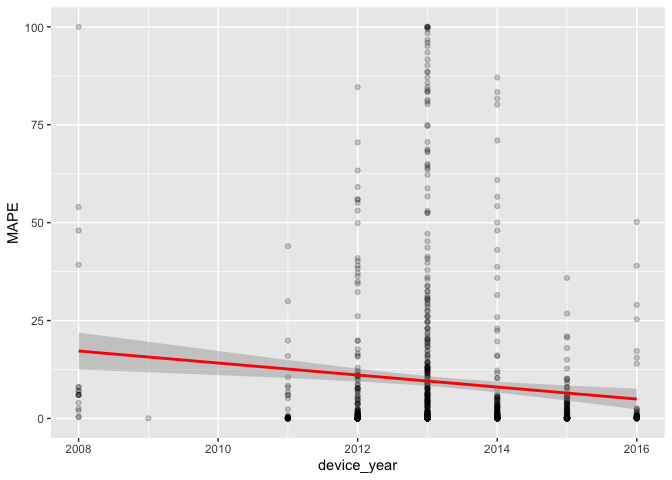

### Packages


```r
library(tidyverse)
```

```
## ── Attaching packages ─────────────────────────────────────── tidyverse 1.3.2 ──
## ✔ ggplot2 3.4.0      ✔ purrr   0.3.5 
## ✔ tibble  3.1.8      ✔ dplyr   1.0.10
## ✔ tidyr   1.2.1      ✔ stringr 1.4.1 
## ✔ readr   2.1.3      ✔ forcats 0.5.2 
## ── Conflicts ────────────────────────────────────────── tidyverse_conflicts() ──
## ✖ dplyr::filter() masks stats::filter()
## ✖ dplyr::lag()    masks stats::lag()
```

```r
library(readxl)
library(broom)
library(broom.mixed)
library(lme4)
```

```
## Loading required package: Matrix
## 
## Attaching package: 'Matrix'
## 
## The following objects are masked from 'package:tidyr':
## 
##     expand, pack, unpack
```

```r
library(rstatix)
```

```
## 
## Attaching package: 'rstatix'
## 
## The following object is masked from 'package:stats':
## 
##     filter
```

```r
library(gtsummary)
library(knitr)
```

### Reading in data


```r
validity1 <- read_csv("wearable_review_data_validity.csv")
```

```
## Rows: 1672 Columns: 107
## ── Column specification ────────────────────────────────────────────────────────
## Delimiter: ","
## chr (62): Author, Substudy, Setting, Measured, Measure_Unit, Brand, Device, ...
## dbl (44): X1, Year, device_year, age_SD, weight_SD, height_SD, BMI_SD, actua...
## lgl  (1): n_15pctofcrit
## 
## ℹ Use `spec()` to retrieve the full column specification for this data.
## ℹ Specify the column types or set `show_col_types = FALSE` to quiet this message.
```

```r
validity <- select(validity1, 1:37, MPE, MAPE)

write_csv(validity, "validity_over_time.csv")

validity <- validity %>% 
  mutate(MAPE = ifelse(is.na(MAPE),
                            abs(MPE*100),
                            MAPE))
```

### Reading in data


```r
glimpse(validity)
```

```
## Rows: 1,672
## Columns: 39
## $ X1                 <dbl> 1, 2, 3, 4, 5, 6, 7, 8, 9, 10, 11, 12, 13, 14, 15, …
## $ Author             <chr> "Dooley", "Dooley", "Dooley", "Boudreaux", "Boudrea…
## $ Year               <dbl> 2017, 2017, 2017, 2018, 2018, 2018, 2017, 2017, 201…
## $ Substudy           <chr> "-", "-", "-", "-", "-", "-", "-", "-", "-", "-", "…
## $ Setting            <chr> "Controlled", "Controlled", "Controlled", "Controll…
## $ Measured           <chr> "HR", "HR", "HR", "HR", "HR", "HR", "SC", "SC", "SC…
## $ Measure_Unit       <chr> "bpm", "bpm", "bpm", "bpm", "bpm", "bpm", "steps/10…
## $ Brand              <chr> "Apple", "Apple", "Apple", "Apple", "Apple", "Apple…
## $ Device             <chr> "Watch", "Watch", "Watch", "Watch Series 2", "Watch…
## $ device_name        <chr> "Apple Watch", "Apple Watch", "Apple Watch", "Apple…
## $ device_year        <dbl> 2015, 2015, 2015, 2016, 2016, 2016, 2015, 2015, 201…
## $ Wear_Location      <chr> "Wrist", "Wrist", "Wrist", "Wrist", "Wrist", "Wrist…
## $ Wear_Info          <chr> "wrist, random", "wrist, random", "wrist, random", …
## $ Type               <chr> "full-text", "full-text", "full-text", "full-text",…
## $ `Good?`            <chr> "y", "y", "y", "y", "y", "y", "y", "y", "y", "y", "…
## $ Criterion_Measure  <chr> "Heart rate sensor chest strap (Polar T31)", "Heart…
## $ Criterion_Type     <chr> "chest strap", "chest strap", "chest strap", "ECG",…
## $ Wear_Info_crit     <chr> "chest", "chest", "chest", "upper torso", "upper to…
## $ Wear_Location_crit <chr> "Torso", "Torso", "Torso", "Torso", "Torso", "Torso…
## $ population_n       <chr> "62", "62", "62", "50", "50", "50", "31", "31", "31…
## $ population_m       <chr> "26", "26", "26", "22", "22", "22", "16", "16", "16…
## $ population_f       <chr> "36", "36", "36", "28", "28", "28", "15", "15", "15…
## $ population         <chr> "healthy adults", "healthy adults", "healthy adults…
## $ age_code           <chr> "A", "A", "A", "A", "A", "A", "A", "A", "A", "A", "…
## $ health_code        <chr> "H", "H", "H", "H", "H", "H", "H", "H", "H", "H", "…
## $ age                <chr> "22.55", "22.55", "22.55", "22.71", "22.71", "22.71…
## $ age_SD             <dbl> 4.34, 4.34, 4.34, 2.99, 2.99, 2.99, 12.00, 12.00, 1…
## $ weight             <chr> "72.02", "72.02", "72.02", "67.79", "67.79", "67.79…
## $ weight_SD          <dbl> 18.99, 18.99, 18.99, 14.01, 14.01, 14.01, NA, NA, N…
## $ height             <chr> "170", "170", "170", "162.71", "162.71", "162.71", …
## $ height_SD          <dbl> 11.00, 11.00, 11.00, 5.79, 5.79, 5.79, NA, NA, NA, …
## $ BMI                <chr> "24.6", "24.6", "24.6", "25.83", "25.83", "25.83", …
## $ BMI_SD             <dbl> 4.77, 4.77, 4.77, 4.83, 4.83, 4.83, 2.40, 2.40, 2.4…
## $ location           <chr> "TX, USA", "TX, USA", "TX, USA", "LA, USA", "LA, US…
## $ activity_type      <chr> "Rest: Seated", "Rest: Seated", "Rest: Seated", "Re…
## $ test_type          <chr> "Rest", "Rest", "Rest", "Rest", "Rest", "Activity",…
## $ activity_type_code <chr> "Se", "Se", "Se", "Se", "Se", "Mi", "At", "At", "At…
## $ MPE                <dbl> 0.007190265, 0.001096041, -0.005327335, NA, NA, NA,…
## $ MAPE               <dbl> 0.0276, 0.0163, 0.0114, 0.0121, 0.0144, 0.0299, 0.0…
```


### Removing Xiaomi and Mio (only one year of devices)


```r
validity <- subset(validity, Brand != "Mio" & Brand != "Xiaomi")
```

### Filtering the data for SC


```r
clean_data <- subset(validity, Measured != "EE" & Measured != "HR")

### Create study_year variable

clean_data$study_year <- str_c(clean_data$Author, clean_data$Year, sep = "_")
length(clean_data$study_year)
```

```
## [1] 1056
```


### Number of SC validity tests conducted within each brand


```r
table(clean_data$Brand)
```

```
## 
##    Apple   Fitbit   Garmin   Misfit    Polar  Samsung Withings 
##       31      673      169       42       42       15       84
```

There are 7 different brands of commercial wearable devices included in this study. They are: Apple (31 validity tests), Fitbit (673 validity tests), Garmin (169 validity tests), Misfit (42 validity tests), Polar (42 validity tests), Samsung (15 validity tests) and Withings (84 validity tests).

### Number of SC validity tests conducted within each device type per Brand


```r
table(clean_data$device_name)
```

```
## 
##             Apple Watch    Apple Watch Series 2                  Fitbit 
##                      30                       1                       3 
##           Fitbit Charge         Fitbit Charge 2        Fitbit Charge HR 
##                      21                      30                      76 
##          Fitbit Classic             Fitbit Flex            Fitbit Force 
##                      17                     109                       6 
##              Fitbit One            Fitbit Surge            Fitbit Ultra 
##                     160                      18                      39 
##              Fitbit Zip   Garmin Forerunner 235 Garmin Forerunner 405CX 
##                     194                       2                       1 
## Garmin Forerunner 735XT Garmin Forerunner 920XT       Garmin Vivoactive 
##                       3                       6                       6 
##          Garmin Vivofit        Garmin Vivofit 2        Garmin Vivofit 3 
##                      81                      11                       6 
##        Garmin Vivosmart     Garmin Vivosmart HR    Garmin Vivosmart HR+ 
##                      14                      13                      26 
##            Misfit Flash            Misfit Shine              Polar A300 
##                       6                      36                       1 
##              Polar A360            Polar Active              Polar Loop 
##                       6                       6                      27 
##              Polar M600              Polar V800          Samsung Gear 2 
##                       1                       1                       4 
##          Samsung Gear S         Samsung Gear S2         Samsung Gear S3 
##                       7                       3                       1 
##       Withings Pulse O2       Withings Pulse Ox 
##                      50                      34
```

There are multiple of device types within each brand that were tested for step count validity. Apple has two device types tested: Apple Watch (30 validity tests) and Apple Watch Series 2 (1 validity test). Fitbit has 11 device types: Fitbit (3), Fitbit Charge (21), Fitbit Charge 2 (30), Fitbit Charge HR (76), Fitbit Classic (17), Fitbit Flex (109), Fitbit Force (6), Fitbit One (160), Fitbit Surge (18), Fitbit Ultra (39), Fitbit Zip (194). Garmin has 11 device types: Garmin Forerunner 235 (2), Garmin Forerunner 405CX (1), Garmin Forerunner 735XT (3), Garmin Forerunner 920XT (6), Garmin Vivoactive (6), Garmin Vivofit (81), Garmin Vivofit 2 (11), Garmin Vivofit 3 (6), Garmin Vivosmart (14), Garmin Vivosmart HR (13) and Garmin Vivosmart HR+ (26). Misfit has two device types: Misfit Flash (6) and Misfit Shine (36). Polar has 6 device types: Polar A300 (1), Polar A360 (6), Polar Active (6), Polar Loop (27), Polar M600 (1) and Polar V800 (1). Samsung has 4 device types: Samsung Gear 2 (4), Samsung Gear S (7), Samsung Gear S2 (3) and Samsung Gear S3 (1). Withings has 2 device types: Withings Pulse O2 (50) and Withings Pulse Ox (34).


### Number of devices tested for step count per brand and year of release


```r
brand_time <- table(clean_data$Brand, clean_data$device_year)
kable(brand_time)
```


|         | 2008| 2009| 2011| 2012| 2013| 2014| 2015| 2016|
|:--------|----:|----:|----:|----:|----:|----:|----:|----:|
|Apple    |    0|    0|    0|    0|    0|    0|   30|    1|
|Fitbit   |   17|    0|   39|  160|  309|   21|   94|   30|
|Garmin   |    0|    1|    0|    0|    0|  101|   32|   35|
|Misfit   |    0|    0|    0|   36|    0|    0|    6|    0|
|Polar    |    0|    0|    6|    0|   27|    1|    7|    1|
|Samsung  |    0|    0|    0|    0|    0|   11|    3|    1|
|Withings |    0|    0|    0|    0|   50|   34|    0|    0|

```r
histo_device_year_Brand <- ggplot(data = clean_data, aes(device_year)) +
        geom_histogram() +
        facet_wrap(~ Brand)

plot(histo_device_year_Brand)
```

```
## `stat_bin()` using `bins = 30`. Pick better value with `binwidth`.
```

```
## Warning: Removed 3 rows containing non-finite values (`stat_bin()`).
```

<!-- -->

### Summary of Mean Absolute Percentage Error for SC of all brands


```r
summary(clean_data$MAPE)
```

```
##    Min. 1st Qu.  Median    Mean 3rd Qu.    Max.    NA's 
##   0.000   0.069   0.600   9.142   6.900 100.000      91
```

```r
mape_time <- clean_data %>%
    group_by(Brand, device_year) %>%
    get_summary_stats(MAPE, type = "mean_sd") %>%
    arrange(Brand, device_year)
kable(mape_time)
```


|Brand    | device_year|variable |   n|   mean|     sd|
|:--------|-----------:|:--------|---:|------:|------:|
|Apple    |        2015|MAPE     |  21|  1.678|  2.129|
|Apple    |        2016|MAPE     |   1|  0.420|     NA|
|Fitbit   |        2008|MAPE     |  17| 17.910| 27.046|
|Fitbit   |        2011|MAPE     |  37|  1.958|  5.901|
|Fitbit   |        2012|MAPE     | 145|  5.020| 11.668|
|Fitbit   |        2013|MAPE     | 290| 15.816| 25.714|
|Fitbit   |        2014|MAPE     |  20| 22.754| 29.263|
|Fitbit   |        2015|MAPE     |  84|  3.378|  6.407|
|Fitbit   |        2016|MAPE     |  25|  3.592|  9.753|
|Fitbit   |          NA|MAPE     |   3| 11.197| 10.413|
|Garmin   |        2009|MAPE     |   1|  0.041|     NA|
|Garmin   |        2014|MAPE     |  97|  6.290| 16.190|
|Garmin   |        2015|MAPE     |  19|  0.620|  1.317|
|Garmin   |        2016|MAPE     |  32|  2.332|  5.639|
|Misfit   |        2012|MAPE     |  35| 16.691| 23.339|
|Misfit   |        2015|MAPE     |   6|  0.101|  0.053|
|Polar    |        2011|MAPE     |   6| 15.594| 14.294|
|Polar    |        2013|MAPE     |  27|  2.166|  4.085|
|Polar    |        2014|MAPE     |   1| 22.959|     NA|
|Polar    |        2015|MAPE     |   6|  3.490|  3.396|
|Polar    |        2016|MAPE     |   1| 50.180|     NA|
|Samsung  |        2014|MAPE     |  11|  2.412|  2.945|
|Samsung  |        2015|MAPE     |   3|  2.783|  1.454|
|Samsung  |        2016|MAPE     |   1|  0.210|     NA|
|Withings |        2013|MAPE     |  47| 13.424| 29.523|
|Withings |        2014|MAPE     |  29|  1.357|  3.047|

```r
histo_MAPE_SC <- ggplot(data = clean_data, aes(MAPE)) +
        geom_histogram(bins = 45) + 
        theme_bw()

plot(histo_MAPE_SC)
```

```
## Warning: Removed 91 rows containing non-finite values (`stat_bin()`).
```

<!-- -->

The histogram indicates that the MAPE values are not normally distributed and that there is an extreme positive skewness. Majority of the MAPE values lie to the left of the distribution. The mean is likely not be a good measure of central tendency for this data because of the degree of skewness seen in the histogram. Therefore, we will want to use the median value instead.


### Scatter plot for SC MAPE for all brands compared to device years of release


```r
scatter_MAPE_year_SC <- ggplot(data = clean_data, aes(x = device_year, y = MAPE)) +
      geom_point(alpha = 0.2) +
      stat_smooth(method = "lm", colour = "gray") + 
      stat_smooth() + 
      theme_classic()

plot(scatter_MAPE_year_SC)
```

```
## `geom_smooth()` using formula = 'y ~ x'
```

```
## Warning: Removed 94 rows containing non-finite values (`stat_smooth()`).
```

```
## `geom_smooth()` using method = 'gam' and formula = 'y ~ s(x, bs = "cs")'
```

```
## Warning: Removed 94 rows containing non-finite values (`stat_smooth()`).
```

```
## Warning: Computation failed in `stat_smooth()`
## Caused by error in `smooth.construct.cr.smooth.spec()`:
## ! x has insufficient unique values to support 10 knots: reduce k.
```

```
## Warning: Removed 94 rows containing missing values (`geom_point()`).
```

<!-- -->

As seen in the above scatter plot, as time (device year of release) increases, the Mean Absolute Percentage Error of Step Count measurement increases. MAPE is representative of accuracy, therefore the accuracy for these commercial wearable devices to measure step count decreases over time. 


### Scatter plot for SC MAPE per brand compared to device years of release


```r
scatter_MAPE_year_Brand <- ggplot(data = clean_data, aes(x = device_year, y = MAPE)) +
      geom_point(alpha = 0.2) +
      stat_smooth(method = "lm", colour = "gray") +
      facet_wrap(~ Brand) +
      theme_bw()

plot(scatter_MAPE_year_Brand)
```

```
## `geom_smooth()` using formula = 'y ~ x'
```

```
## Warning: Removed 94 rows containing non-finite values (`stat_smooth()`).
```

```
## Warning: Removed 94 rows containing missing values (`geom_point()`).
```

<!-- -->

As seen in the above figure, the accuracy of wearable devices to measure step count varies by brand. Of the validity tests conducted using Apple devices, there was a decrease in MAPE values between devices released in 2015 and 2016. This indicates that the accuracy of Apple devices increased with the release of a newer version of wearable technology. When analyzing the data for the brand Fitbit, it can be seen that there was an increased in MAPE values between devices released from 2011-2016. This indicates that the accuracy of Fitbit devices decreased with the release of newer versions of wearable technology. A similar trend was seen in Garmin devices released between the years of 2009-2016. The step count accuracy of these devices decreased as well. The brands Misfit and Polar show increases in accuracy in devices released from 2012-2015 and 2013-2015, respectively. Samsung and Withings show decreases in accuracy in devices released from 2014-2016 ans 2013-2014, respectively. 

## Linear Regression: Device year as a predictor of Step Count MAPE


```r
lm_year_MAPE <- lm(MAPE ~ device_year, data = clean_data)

summary(lm_year_MAPE)
```

```
## 
## Call:
## lm(formula = MAPE ~ device_year, data = clean_data)
## 
## Residuals:
##     Min      1Q  Median      3Q     Max 
## -16.889  -9.488  -6.472  -2.376  90.448 
## 
## Coefficients:
##              Estimate Std. Error t value Pr(>|t|)    
## (Intercept) 3096.0530   886.6980   3.492 0.000502 ***
## device_year   -1.5333     0.4404  -3.481 0.000521 ***
## ---
## Signif. codes:  0 '***' 0.001 '**' 0.01 '*' 0.05 '.' 0.1 ' ' 1
## 
## Residual standard error: 19.58 on 960 degrees of freedom
##   (94 observations deleted due to missingness)
## Multiple R-squared:  0.01247,	Adjusted R-squared:  0.01144 
## F-statistic: 12.12 on 1 and 960 DF,  p-value: 0.0005213
```

```r
tbl_regression(lm_year_MAPE)
```

```{=html}
<div id="iiizjlmkvy" style="padding-left:0px;padding-right:0px;padding-top:10px;padding-bottom:10px;overflow-x:auto;overflow-y:auto;width:auto;height:auto;">
<style>html {
  font-family: -apple-system, BlinkMacSystemFont, 'Segoe UI', Roboto, Oxygen, Ubuntu, Cantarell, 'Helvetica Neue', 'Fira Sans', 'Droid Sans', Arial, sans-serif;
}

#iiizjlmkvy .gt_table {
  display: table;
  border-collapse: collapse;
  margin-left: auto;
  margin-right: auto;
  color: #333333;
  font-size: 16px;
  font-weight: normal;
  font-style: normal;
  background-color: #FFFFFF;
  width: auto;
  border-top-style: solid;
  border-top-width: 2px;
  border-top-color: #A8A8A8;
  border-right-style: none;
  border-right-width: 2px;
  border-right-color: #D3D3D3;
  border-bottom-style: solid;
  border-bottom-width: 2px;
  border-bottom-color: #A8A8A8;
  border-left-style: none;
  border-left-width: 2px;
  border-left-color: #D3D3D3;
}

#iiizjlmkvy .gt_heading {
  background-color: #FFFFFF;
  text-align: center;
  border-bottom-color: #FFFFFF;
  border-left-style: none;
  border-left-width: 1px;
  border-left-color: #D3D3D3;
  border-right-style: none;
  border-right-width: 1px;
  border-right-color: #D3D3D3;
}

#iiizjlmkvy .gt_caption {
  padding-top: 4px;
  padding-bottom: 4px;
}

#iiizjlmkvy .gt_title {
  color: #333333;
  font-size: 125%;
  font-weight: initial;
  padding-top: 4px;
  padding-bottom: 4px;
  padding-left: 5px;
  padding-right: 5px;
  border-bottom-color: #FFFFFF;
  border-bottom-width: 0;
}

#iiizjlmkvy .gt_subtitle {
  color: #333333;
  font-size: 85%;
  font-weight: initial;
  padding-top: 0;
  padding-bottom: 6px;
  padding-left: 5px;
  padding-right: 5px;
  border-top-color: #FFFFFF;
  border-top-width: 0;
}

#iiizjlmkvy .gt_bottom_border {
  border-bottom-style: solid;
  border-bottom-width: 2px;
  border-bottom-color: #D3D3D3;
}

#iiizjlmkvy .gt_col_headings {
  border-top-style: solid;
  border-top-width: 2px;
  border-top-color: #D3D3D3;
  border-bottom-style: solid;
  border-bottom-width: 2px;
  border-bottom-color: #D3D3D3;
  border-left-style: none;
  border-left-width: 1px;
  border-left-color: #D3D3D3;
  border-right-style: none;
  border-right-width: 1px;
  border-right-color: #D3D3D3;
}

#iiizjlmkvy .gt_col_heading {
  color: #333333;
  background-color: #FFFFFF;
  font-size: 100%;
  font-weight: normal;
  text-transform: inherit;
  border-left-style: none;
  border-left-width: 1px;
  border-left-color: #D3D3D3;
  border-right-style: none;
  border-right-width: 1px;
  border-right-color: #D3D3D3;
  vertical-align: bottom;
  padding-top: 5px;
  padding-bottom: 6px;
  padding-left: 5px;
  padding-right: 5px;
  overflow-x: hidden;
}

#iiizjlmkvy .gt_column_spanner_outer {
  color: #333333;
  background-color: #FFFFFF;
  font-size: 100%;
  font-weight: normal;
  text-transform: inherit;
  padding-top: 0;
  padding-bottom: 0;
  padding-left: 4px;
  padding-right: 4px;
}

#iiizjlmkvy .gt_column_spanner_outer:first-child {
  padding-left: 0;
}

#iiizjlmkvy .gt_column_spanner_outer:last-child {
  padding-right: 0;
}

#iiizjlmkvy .gt_column_spanner {
  border-bottom-style: solid;
  border-bottom-width: 2px;
  border-bottom-color: #D3D3D3;
  vertical-align: bottom;
  padding-top: 5px;
  padding-bottom: 5px;
  overflow-x: hidden;
  display: inline-block;
  width: 100%;
}

#iiizjlmkvy .gt_group_heading {
  padding-top: 8px;
  padding-bottom: 8px;
  padding-left: 5px;
  padding-right: 5px;
  color: #333333;
  background-color: #FFFFFF;
  font-size: 100%;
  font-weight: initial;
  text-transform: inherit;
  border-top-style: solid;
  border-top-width: 2px;
  border-top-color: #D3D3D3;
  border-bottom-style: solid;
  border-bottom-width: 2px;
  border-bottom-color: #D3D3D3;
  border-left-style: none;
  border-left-width: 1px;
  border-left-color: #D3D3D3;
  border-right-style: none;
  border-right-width: 1px;
  border-right-color: #D3D3D3;
  vertical-align: middle;
  text-align: left;
}

#iiizjlmkvy .gt_empty_group_heading {
  padding: 0.5px;
  color: #333333;
  background-color: #FFFFFF;
  font-size: 100%;
  font-weight: initial;
  border-top-style: solid;
  border-top-width: 2px;
  border-top-color: #D3D3D3;
  border-bottom-style: solid;
  border-bottom-width: 2px;
  border-bottom-color: #D3D3D3;
  vertical-align: middle;
}

#iiizjlmkvy .gt_from_md > :first-child {
  margin-top: 0;
}

#iiizjlmkvy .gt_from_md > :last-child {
  margin-bottom: 0;
}

#iiizjlmkvy .gt_row {
  padding-top: 8px;
  padding-bottom: 8px;
  padding-left: 5px;
  padding-right: 5px;
  margin: 10px;
  border-top-style: solid;
  border-top-width: 1px;
  border-top-color: #D3D3D3;
  border-left-style: none;
  border-left-width: 1px;
  border-left-color: #D3D3D3;
  border-right-style: none;
  border-right-width: 1px;
  border-right-color: #D3D3D3;
  vertical-align: middle;
  overflow-x: hidden;
}

#iiizjlmkvy .gt_stub {
  color: #333333;
  background-color: #FFFFFF;
  font-size: 100%;
  font-weight: initial;
  text-transform: inherit;
  border-right-style: solid;
  border-right-width: 2px;
  border-right-color: #D3D3D3;
  padding-left: 5px;
  padding-right: 5px;
}

#iiizjlmkvy .gt_stub_row_group {
  color: #333333;
  background-color: #FFFFFF;
  font-size: 100%;
  font-weight: initial;
  text-transform: inherit;
  border-right-style: solid;
  border-right-width: 2px;
  border-right-color: #D3D3D3;
  padding-left: 5px;
  padding-right: 5px;
  vertical-align: top;
}

#iiizjlmkvy .gt_row_group_first td {
  border-top-width: 2px;
}

#iiizjlmkvy .gt_summary_row {
  color: #333333;
  background-color: #FFFFFF;
  text-transform: inherit;
  padding-top: 8px;
  padding-bottom: 8px;
  padding-left: 5px;
  padding-right: 5px;
}

#iiizjlmkvy .gt_first_summary_row {
  border-top-style: solid;
  border-top-color: #D3D3D3;
}

#iiizjlmkvy .gt_first_summary_row.thick {
  border-top-width: 2px;
}

#iiizjlmkvy .gt_last_summary_row {
  padding-top: 8px;
  padding-bottom: 8px;
  padding-left: 5px;
  padding-right: 5px;
  border-bottom-style: solid;
  border-bottom-width: 2px;
  border-bottom-color: #D3D3D3;
}

#iiizjlmkvy .gt_grand_summary_row {
  color: #333333;
  background-color: #FFFFFF;
  text-transform: inherit;
  padding-top: 8px;
  padding-bottom: 8px;
  padding-left: 5px;
  padding-right: 5px;
}

#iiizjlmkvy .gt_first_grand_summary_row {
  padding-top: 8px;
  padding-bottom: 8px;
  padding-left: 5px;
  padding-right: 5px;
  border-top-style: double;
  border-top-width: 6px;
  border-top-color: #D3D3D3;
}

#iiizjlmkvy .gt_striped {
  background-color: rgba(128, 128, 128, 0.05);
}

#iiizjlmkvy .gt_table_body {
  border-top-style: solid;
  border-top-width: 2px;
  border-top-color: #D3D3D3;
  border-bottom-style: solid;
  border-bottom-width: 2px;
  border-bottom-color: #D3D3D3;
}

#iiizjlmkvy .gt_footnotes {
  color: #333333;
  background-color: #FFFFFF;
  border-bottom-style: none;
  border-bottom-width: 2px;
  border-bottom-color: #D3D3D3;
  border-left-style: none;
  border-left-width: 2px;
  border-left-color: #D3D3D3;
  border-right-style: none;
  border-right-width: 2px;
  border-right-color: #D3D3D3;
}

#iiizjlmkvy .gt_footnote {
  margin: 0px;
  font-size: 90%;
  padding-left: 4px;
  padding-right: 4px;
  padding-left: 5px;
  padding-right: 5px;
}

#iiizjlmkvy .gt_sourcenotes {
  color: #333333;
  background-color: #FFFFFF;
  border-bottom-style: none;
  border-bottom-width: 2px;
  border-bottom-color: #D3D3D3;
  border-left-style: none;
  border-left-width: 2px;
  border-left-color: #D3D3D3;
  border-right-style: none;
  border-right-width: 2px;
  border-right-color: #D3D3D3;
}

#iiizjlmkvy .gt_sourcenote {
  font-size: 90%;
  padding-top: 4px;
  padding-bottom: 4px;
  padding-left: 5px;
  padding-right: 5px;
}

#iiizjlmkvy .gt_left {
  text-align: left;
}

#iiizjlmkvy .gt_center {
  text-align: center;
}

#iiizjlmkvy .gt_right {
  text-align: right;
  font-variant-numeric: tabular-nums;
}

#iiizjlmkvy .gt_font_normal {
  font-weight: normal;
}

#iiizjlmkvy .gt_font_bold {
  font-weight: bold;
}

#iiizjlmkvy .gt_font_italic {
  font-style: italic;
}

#iiizjlmkvy .gt_super {
  font-size: 65%;
}

#iiizjlmkvy .gt_footnote_marks {
  font-style: italic;
  font-weight: normal;
  font-size: 75%;
  vertical-align: 0.4em;
}

#iiizjlmkvy .gt_asterisk {
  font-size: 100%;
  vertical-align: 0;
}

#iiizjlmkvy .gt_indent_1 {
  text-indent: 5px;
}

#iiizjlmkvy .gt_indent_2 {
  text-indent: 10px;
}

#iiizjlmkvy .gt_indent_3 {
  text-indent: 15px;
}

#iiizjlmkvy .gt_indent_4 {
  text-indent: 20px;
}

#iiizjlmkvy .gt_indent_5 {
  text-indent: 25px;
}
</style>
<table class="gt_table">
  
  <thead class="gt_col_headings">
    <tr>
      <th class="gt_col_heading gt_columns_bottom_border gt_left" rowspan="1" colspan="1" scope="col" id="&lt;strong&gt;Characteristic&lt;/strong&gt;"><strong>Characteristic</strong></th>
      <th class="gt_col_heading gt_columns_bottom_border gt_center" rowspan="1" colspan="1" scope="col" id="&lt;strong&gt;Beta&lt;/strong&gt;"><strong>Beta</strong></th>
      <th class="gt_col_heading gt_columns_bottom_border gt_center" rowspan="1" colspan="1" scope="col" id="&lt;strong&gt;95% CI&lt;/strong&gt;&lt;sup class=&quot;gt_footnote_marks&quot;&gt;1&lt;/sup&gt;"><strong>95% CI</strong><sup class="gt_footnote_marks">1</sup></th>
      <th class="gt_col_heading gt_columns_bottom_border gt_center" rowspan="1" colspan="1" scope="col" id="&lt;strong&gt;p-value&lt;/strong&gt;"><strong>p-value</strong></th>
    </tr>
  </thead>
  <tbody class="gt_table_body">
    <tr><td headers="label" class="gt_row gt_left">device_year</td>
<td headers="estimate" class="gt_row gt_center">-1.5</td>
<td headers="ci" class="gt_row gt_center">-2.4, -0.67</td>
<td headers="p.value" class="gt_row gt_center"><0.001</td></tr>
  </tbody>
  
  <tfoot class="gt_footnotes">
    <tr>
      <td class="gt_footnote" colspan="4"><sup class="gt_footnote_marks">1</sup> CI = Confidence Interval</td>
    </tr>
  </tfoot>
</table>
</div>
```

## MLM Regression: Device year as a predictor of Step Count MAPE and author_year as a random effect


```r
lmer_year_MAPE <- lmer(MAPE ~ device_year + (1 | study_year), data = clean_data)

summary(lmer_year_MAPE)
```

```
## Linear mixed model fit by REML ['lmerMod']
## Formula: MAPE ~ device_year + (1 | study_year)
##    Data: clean_data
## 
## REML criterion at convergence: 8089.8
## 
## Scaled residuals: 
##     Min      1Q  Median      3Q     Max 
## -2.7824 -0.2363 -0.0751 -0.0117  5.2967 
## 
## Random effects:
##  Groups     Name        Variance Std.Dev.
##  study_year (Intercept) 118.6    10.89   
##  Residual               228.2    15.11   
## Number of obs: 962, groups:  study_year, 104
## 
## Fixed effects:
##               Estimate Std. Error t value
## (Intercept)  173.97546 1237.90021   0.141
## device_year   -0.08193    0.61490  -0.133
## 
## Correlation of Fixed Effects:
##             (Intr)
## device_year -1.000
```

```r
tbl_regression(lmer_year_MAPE)
```

```{=html}
<div id="rdjvslcndl" style="padding-left:0px;padding-right:0px;padding-top:10px;padding-bottom:10px;overflow-x:auto;overflow-y:auto;width:auto;height:auto;">
<style>html {
  font-family: -apple-system, BlinkMacSystemFont, 'Segoe UI', Roboto, Oxygen, Ubuntu, Cantarell, 'Helvetica Neue', 'Fira Sans', 'Droid Sans', Arial, sans-serif;
}

#rdjvslcndl .gt_table {
  display: table;
  border-collapse: collapse;
  margin-left: auto;
  margin-right: auto;
  color: #333333;
  font-size: 16px;
  font-weight: normal;
  font-style: normal;
  background-color: #FFFFFF;
  width: auto;
  border-top-style: solid;
  border-top-width: 2px;
  border-top-color: #A8A8A8;
  border-right-style: none;
  border-right-width: 2px;
  border-right-color: #D3D3D3;
  border-bottom-style: solid;
  border-bottom-width: 2px;
  border-bottom-color: #A8A8A8;
  border-left-style: none;
  border-left-width: 2px;
  border-left-color: #D3D3D3;
}

#rdjvslcndl .gt_heading {
  background-color: #FFFFFF;
  text-align: center;
  border-bottom-color: #FFFFFF;
  border-left-style: none;
  border-left-width: 1px;
  border-left-color: #D3D3D3;
  border-right-style: none;
  border-right-width: 1px;
  border-right-color: #D3D3D3;
}

#rdjvslcndl .gt_caption {
  padding-top: 4px;
  padding-bottom: 4px;
}

#rdjvslcndl .gt_title {
  color: #333333;
  font-size: 125%;
  font-weight: initial;
  padding-top: 4px;
  padding-bottom: 4px;
  padding-left: 5px;
  padding-right: 5px;
  border-bottom-color: #FFFFFF;
  border-bottom-width: 0;
}

#rdjvslcndl .gt_subtitle {
  color: #333333;
  font-size: 85%;
  font-weight: initial;
  padding-top: 0;
  padding-bottom: 6px;
  padding-left: 5px;
  padding-right: 5px;
  border-top-color: #FFFFFF;
  border-top-width: 0;
}

#rdjvslcndl .gt_bottom_border {
  border-bottom-style: solid;
  border-bottom-width: 2px;
  border-bottom-color: #D3D3D3;
}

#rdjvslcndl .gt_col_headings {
  border-top-style: solid;
  border-top-width: 2px;
  border-top-color: #D3D3D3;
  border-bottom-style: solid;
  border-bottom-width: 2px;
  border-bottom-color: #D3D3D3;
  border-left-style: none;
  border-left-width: 1px;
  border-left-color: #D3D3D3;
  border-right-style: none;
  border-right-width: 1px;
  border-right-color: #D3D3D3;
}

#rdjvslcndl .gt_col_heading {
  color: #333333;
  background-color: #FFFFFF;
  font-size: 100%;
  font-weight: normal;
  text-transform: inherit;
  border-left-style: none;
  border-left-width: 1px;
  border-left-color: #D3D3D3;
  border-right-style: none;
  border-right-width: 1px;
  border-right-color: #D3D3D3;
  vertical-align: bottom;
  padding-top: 5px;
  padding-bottom: 6px;
  padding-left: 5px;
  padding-right: 5px;
  overflow-x: hidden;
}

#rdjvslcndl .gt_column_spanner_outer {
  color: #333333;
  background-color: #FFFFFF;
  font-size: 100%;
  font-weight: normal;
  text-transform: inherit;
  padding-top: 0;
  padding-bottom: 0;
  padding-left: 4px;
  padding-right: 4px;
}

#rdjvslcndl .gt_column_spanner_outer:first-child {
  padding-left: 0;
}

#rdjvslcndl .gt_column_spanner_outer:last-child {
  padding-right: 0;
}

#rdjvslcndl .gt_column_spanner {
  border-bottom-style: solid;
  border-bottom-width: 2px;
  border-bottom-color: #D3D3D3;
  vertical-align: bottom;
  padding-top: 5px;
  padding-bottom: 5px;
  overflow-x: hidden;
  display: inline-block;
  width: 100%;
}

#rdjvslcndl .gt_group_heading {
  padding-top: 8px;
  padding-bottom: 8px;
  padding-left: 5px;
  padding-right: 5px;
  color: #333333;
  background-color: #FFFFFF;
  font-size: 100%;
  font-weight: initial;
  text-transform: inherit;
  border-top-style: solid;
  border-top-width: 2px;
  border-top-color: #D3D3D3;
  border-bottom-style: solid;
  border-bottom-width: 2px;
  border-bottom-color: #D3D3D3;
  border-left-style: none;
  border-left-width: 1px;
  border-left-color: #D3D3D3;
  border-right-style: none;
  border-right-width: 1px;
  border-right-color: #D3D3D3;
  vertical-align: middle;
  text-align: left;
}

#rdjvslcndl .gt_empty_group_heading {
  padding: 0.5px;
  color: #333333;
  background-color: #FFFFFF;
  font-size: 100%;
  font-weight: initial;
  border-top-style: solid;
  border-top-width: 2px;
  border-top-color: #D3D3D3;
  border-bottom-style: solid;
  border-bottom-width: 2px;
  border-bottom-color: #D3D3D3;
  vertical-align: middle;
}

#rdjvslcndl .gt_from_md > :first-child {
  margin-top: 0;
}

#rdjvslcndl .gt_from_md > :last-child {
  margin-bottom: 0;
}

#rdjvslcndl .gt_row {
  padding-top: 8px;
  padding-bottom: 8px;
  padding-left: 5px;
  padding-right: 5px;
  margin: 10px;
  border-top-style: solid;
  border-top-width: 1px;
  border-top-color: #D3D3D3;
  border-left-style: none;
  border-left-width: 1px;
  border-left-color: #D3D3D3;
  border-right-style: none;
  border-right-width: 1px;
  border-right-color: #D3D3D3;
  vertical-align: middle;
  overflow-x: hidden;
}

#rdjvslcndl .gt_stub {
  color: #333333;
  background-color: #FFFFFF;
  font-size: 100%;
  font-weight: initial;
  text-transform: inherit;
  border-right-style: solid;
  border-right-width: 2px;
  border-right-color: #D3D3D3;
  padding-left: 5px;
  padding-right: 5px;
}

#rdjvslcndl .gt_stub_row_group {
  color: #333333;
  background-color: #FFFFFF;
  font-size: 100%;
  font-weight: initial;
  text-transform: inherit;
  border-right-style: solid;
  border-right-width: 2px;
  border-right-color: #D3D3D3;
  padding-left: 5px;
  padding-right: 5px;
  vertical-align: top;
}

#rdjvslcndl .gt_row_group_first td {
  border-top-width: 2px;
}

#rdjvslcndl .gt_summary_row {
  color: #333333;
  background-color: #FFFFFF;
  text-transform: inherit;
  padding-top: 8px;
  padding-bottom: 8px;
  padding-left: 5px;
  padding-right: 5px;
}

#rdjvslcndl .gt_first_summary_row {
  border-top-style: solid;
  border-top-color: #D3D3D3;
}

#rdjvslcndl .gt_first_summary_row.thick {
  border-top-width: 2px;
}

#rdjvslcndl .gt_last_summary_row {
  padding-top: 8px;
  padding-bottom: 8px;
  padding-left: 5px;
  padding-right: 5px;
  border-bottom-style: solid;
  border-bottom-width: 2px;
  border-bottom-color: #D3D3D3;
}

#rdjvslcndl .gt_grand_summary_row {
  color: #333333;
  background-color: #FFFFFF;
  text-transform: inherit;
  padding-top: 8px;
  padding-bottom: 8px;
  padding-left: 5px;
  padding-right: 5px;
}

#rdjvslcndl .gt_first_grand_summary_row {
  padding-top: 8px;
  padding-bottom: 8px;
  padding-left: 5px;
  padding-right: 5px;
  border-top-style: double;
  border-top-width: 6px;
  border-top-color: #D3D3D3;
}

#rdjvslcndl .gt_striped {
  background-color: rgba(128, 128, 128, 0.05);
}

#rdjvslcndl .gt_table_body {
  border-top-style: solid;
  border-top-width: 2px;
  border-top-color: #D3D3D3;
  border-bottom-style: solid;
  border-bottom-width: 2px;
  border-bottom-color: #D3D3D3;
}

#rdjvslcndl .gt_footnotes {
  color: #333333;
  background-color: #FFFFFF;
  border-bottom-style: none;
  border-bottom-width: 2px;
  border-bottom-color: #D3D3D3;
  border-left-style: none;
  border-left-width: 2px;
  border-left-color: #D3D3D3;
  border-right-style: none;
  border-right-width: 2px;
  border-right-color: #D3D3D3;
}

#rdjvslcndl .gt_footnote {
  margin: 0px;
  font-size: 90%;
  padding-left: 4px;
  padding-right: 4px;
  padding-left: 5px;
  padding-right: 5px;
}

#rdjvslcndl .gt_sourcenotes {
  color: #333333;
  background-color: #FFFFFF;
  border-bottom-style: none;
  border-bottom-width: 2px;
  border-bottom-color: #D3D3D3;
  border-left-style: none;
  border-left-width: 2px;
  border-left-color: #D3D3D3;
  border-right-style: none;
  border-right-width: 2px;
  border-right-color: #D3D3D3;
}

#rdjvslcndl .gt_sourcenote {
  font-size: 90%;
  padding-top: 4px;
  padding-bottom: 4px;
  padding-left: 5px;
  padding-right: 5px;
}

#rdjvslcndl .gt_left {
  text-align: left;
}

#rdjvslcndl .gt_center {
  text-align: center;
}

#rdjvslcndl .gt_right {
  text-align: right;
  font-variant-numeric: tabular-nums;
}

#rdjvslcndl .gt_font_normal {
  font-weight: normal;
}

#rdjvslcndl .gt_font_bold {
  font-weight: bold;
}

#rdjvslcndl .gt_font_italic {
  font-style: italic;
}

#rdjvslcndl .gt_super {
  font-size: 65%;
}

#rdjvslcndl .gt_footnote_marks {
  font-style: italic;
  font-weight: normal;
  font-size: 75%;
  vertical-align: 0.4em;
}

#rdjvslcndl .gt_asterisk {
  font-size: 100%;
  vertical-align: 0;
}

#rdjvslcndl .gt_indent_1 {
  text-indent: 5px;
}

#rdjvslcndl .gt_indent_2 {
  text-indent: 10px;
}

#rdjvslcndl .gt_indent_3 {
  text-indent: 15px;
}

#rdjvslcndl .gt_indent_4 {
  text-indent: 20px;
}

#rdjvslcndl .gt_indent_5 {
  text-indent: 25px;
}
</style>
<table class="gt_table">
  
  <thead class="gt_col_headings">
    <tr>
      <th class="gt_col_heading gt_columns_bottom_border gt_left" rowspan="1" colspan="1" scope="col" id="&lt;strong&gt;Characteristic&lt;/strong&gt;"><strong>Characteristic</strong></th>
      <th class="gt_col_heading gt_columns_bottom_border gt_center" rowspan="1" colspan="1" scope="col" id="&lt;strong&gt;Beta&lt;/strong&gt;"><strong>Beta</strong></th>
      <th class="gt_col_heading gt_columns_bottom_border gt_center" rowspan="1" colspan="1" scope="col" id="&lt;strong&gt;95% CI&lt;/strong&gt;&lt;sup class=&quot;gt_footnote_marks&quot;&gt;1&lt;/sup&gt;"><strong>95% CI</strong><sup class="gt_footnote_marks">1</sup></th>
    </tr>
  </thead>
  <tbody class="gt_table_body">
    <tr><td headers="label" class="gt_row gt_left">device_year</td>
<td headers="estimate" class="gt_row gt_center">-0.08</td>
<td headers="ci" class="gt_row gt_center">-1.3, 1.1</td></tr>
  </tbody>
  
  <tfoot class="gt_footnotes">
    <tr>
      <td class="gt_footnote" colspan="3"><sup class="gt_footnote_marks">1</sup> CI = Confidence Interval</td>
    </tr>
  </tfoot>
</table>
</div>
```

```r
predicted_data <- lmer_year_MAPE@frame
predicted_data$fitted <- fitted(lmer_year_MAPE)
```

## Scatter plot of fitted values


```r
scatter_fitted_year <- ggplot(data = predicted_data, aes(x = device_year, y = MAPE)) +
      geom_point(alpha = 0.2) +
      stat_smooth(method = "lm", colour = "red") 

plot(scatter_fitted_year)
```

```
## `geom_smooth()` using formula = 'y ~ x'
```

<!-- -->


### Linear Regression: Analyzing SC MAPE with Brand as a predictor


```r
lm_Brand_MAPE <- lm(MAPE ~ Brand, data = clean_data)

summary(lm_Brand_MAPE)
```

```
## 
## Call:
## lm(formula = MAPE ~ Brand, data = clean_data)
## 
## Residuals:
##     Min      1Q  Median      3Q     Max 
## -14.261 -10.363  -6.054  -1.105  91.020 
## 
## Coefficients:
##               Estimate Std. Error t value Pr(>|t|)  
## (Intercept)     1.6205     4.1629   0.389   0.6972  
## BrandFitbit     8.9332     4.2360   2.109   0.0352 *
## BrandGarmin     3.0546     4.4596   0.685   0.4935  
## BrandMisfit    12.6429     5.1603   2.450   0.0145 *
## BrandPolar      4.3828     5.1603   0.849   0.3959  
## BrandSamsung    0.7186     6.5381   0.110   0.9125  
## BrandWithings   7.1992     4.7272   1.523   0.1281  
## ---
## Signif. codes:  0 '***' 0.001 '**' 0.01 '*' 0.05 '.' 0.1 ' ' 1
## 
## Residual standard error: 19.53 on 958 degrees of freedom
##   (91 observations deleted due to missingness)
## Multiple R-squared:  0.02048,	Adjusted R-squared:  0.01435 
## F-statistic: 3.338 on 6 and 958 DF,  p-value: 0.002927
```

### Linear Regression: Analyzing differences in SC MAPE with device year and brand as factors


```r
## MLM Regression: Device year as a predictor of Step Count MAPE and author_year as a random effect

lmer_year_by_brand_MAPE <- lmer(MAPE ~ device_year*Brand + (1 | study_year), data = clean_data)

summary(lmer_year_by_brand_MAPE)
```

```
## Linear mixed model fit by REML ['lmerMod']
## Formula: MAPE ~ device_year * Brand + (1 | study_year)
##    Data: clean_data
## 
## REML criterion at convergence: 8033.3
## 
## Scaled residuals: 
##     Min      1Q  Median      3Q     Max 
## -2.8694 -0.2380 -0.0851  0.0301  5.2898 
## 
## Random effects:
##  Groups     Name        Variance Std.Dev.
##  study_year (Intercept) 119.6    10.94   
##  Residual               230.1    15.17   
## Number of obs: 962, groups:  study_year, 104
## 
## Fixed effects:
##                             Estimate Std. Error t value
## (Intercept)                6142.2900 35808.2152   0.172
## device_year                  -3.0448    17.7704  -0.171
## BrandFitbit               -6707.4177 35845.0989  -0.187
## BrandGarmin               -6980.4793 35976.5346  -0.194
## BrandMisfit               -5322.8555 36321.7900  -0.147
## BrandPolar                -9757.6078 36307.8766  -0.269
## BrandSamsung              -1084.9111 36220.7141  -0.030
## BrandWithings             -1126.5861 37001.0255  -0.030
## device_year:BrandFitbit       3.3301    17.7887   0.187
## device_year:BrandGarmin       3.4646    17.8540   0.194
## device_year:BrandMisfit       2.6422    18.0258   0.147
## device_year:BrandPolar        4.8461    18.0188   0.269
## device_year:BrandSamsung      0.5383    17.9756   0.030
## device_year:BrandWithings     0.5588    18.3633   0.030
```

```
## 
## Correlation matrix not shown by default, as p = 14 > 12.
## Use print(x, correlation=TRUE)  or
##     vcov(x)        if you need it
```

```r
tbl_regression(lmer_year_by_brand_MAPE)
```

```{=html}
<div id="kficwduvdw" style="padding-left:0px;padding-right:0px;padding-top:10px;padding-bottom:10px;overflow-x:auto;overflow-y:auto;width:auto;height:auto;">
<style>html {
  font-family: -apple-system, BlinkMacSystemFont, 'Segoe UI', Roboto, Oxygen, Ubuntu, Cantarell, 'Helvetica Neue', 'Fira Sans', 'Droid Sans', Arial, sans-serif;
}

#kficwduvdw .gt_table {
  display: table;
  border-collapse: collapse;
  margin-left: auto;
  margin-right: auto;
  color: #333333;
  font-size: 16px;
  font-weight: normal;
  font-style: normal;
  background-color: #FFFFFF;
  width: auto;
  border-top-style: solid;
  border-top-width: 2px;
  border-top-color: #A8A8A8;
  border-right-style: none;
  border-right-width: 2px;
  border-right-color: #D3D3D3;
  border-bottom-style: solid;
  border-bottom-width: 2px;
  border-bottom-color: #A8A8A8;
  border-left-style: none;
  border-left-width: 2px;
  border-left-color: #D3D3D3;
}

#kficwduvdw .gt_heading {
  background-color: #FFFFFF;
  text-align: center;
  border-bottom-color: #FFFFFF;
  border-left-style: none;
  border-left-width: 1px;
  border-left-color: #D3D3D3;
  border-right-style: none;
  border-right-width: 1px;
  border-right-color: #D3D3D3;
}

#kficwduvdw .gt_caption {
  padding-top: 4px;
  padding-bottom: 4px;
}

#kficwduvdw .gt_title {
  color: #333333;
  font-size: 125%;
  font-weight: initial;
  padding-top: 4px;
  padding-bottom: 4px;
  padding-left: 5px;
  padding-right: 5px;
  border-bottom-color: #FFFFFF;
  border-bottom-width: 0;
}

#kficwduvdw .gt_subtitle {
  color: #333333;
  font-size: 85%;
  font-weight: initial;
  padding-top: 0;
  padding-bottom: 6px;
  padding-left: 5px;
  padding-right: 5px;
  border-top-color: #FFFFFF;
  border-top-width: 0;
}

#kficwduvdw .gt_bottom_border {
  border-bottom-style: solid;
  border-bottom-width: 2px;
  border-bottom-color: #D3D3D3;
}

#kficwduvdw .gt_col_headings {
  border-top-style: solid;
  border-top-width: 2px;
  border-top-color: #D3D3D3;
  border-bottom-style: solid;
  border-bottom-width: 2px;
  border-bottom-color: #D3D3D3;
  border-left-style: none;
  border-left-width: 1px;
  border-left-color: #D3D3D3;
  border-right-style: none;
  border-right-width: 1px;
  border-right-color: #D3D3D3;
}

#kficwduvdw .gt_col_heading {
  color: #333333;
  background-color: #FFFFFF;
  font-size: 100%;
  font-weight: normal;
  text-transform: inherit;
  border-left-style: none;
  border-left-width: 1px;
  border-left-color: #D3D3D3;
  border-right-style: none;
  border-right-width: 1px;
  border-right-color: #D3D3D3;
  vertical-align: bottom;
  padding-top: 5px;
  padding-bottom: 6px;
  padding-left: 5px;
  padding-right: 5px;
  overflow-x: hidden;
}

#kficwduvdw .gt_column_spanner_outer {
  color: #333333;
  background-color: #FFFFFF;
  font-size: 100%;
  font-weight: normal;
  text-transform: inherit;
  padding-top: 0;
  padding-bottom: 0;
  padding-left: 4px;
  padding-right: 4px;
}

#kficwduvdw .gt_column_spanner_outer:first-child {
  padding-left: 0;
}

#kficwduvdw .gt_column_spanner_outer:last-child {
  padding-right: 0;
}

#kficwduvdw .gt_column_spanner {
  border-bottom-style: solid;
  border-bottom-width: 2px;
  border-bottom-color: #D3D3D3;
  vertical-align: bottom;
  padding-top: 5px;
  padding-bottom: 5px;
  overflow-x: hidden;
  display: inline-block;
  width: 100%;
}

#kficwduvdw .gt_group_heading {
  padding-top: 8px;
  padding-bottom: 8px;
  padding-left: 5px;
  padding-right: 5px;
  color: #333333;
  background-color: #FFFFFF;
  font-size: 100%;
  font-weight: initial;
  text-transform: inherit;
  border-top-style: solid;
  border-top-width: 2px;
  border-top-color: #D3D3D3;
  border-bottom-style: solid;
  border-bottom-width: 2px;
  border-bottom-color: #D3D3D3;
  border-left-style: none;
  border-left-width: 1px;
  border-left-color: #D3D3D3;
  border-right-style: none;
  border-right-width: 1px;
  border-right-color: #D3D3D3;
  vertical-align: middle;
  text-align: left;
}

#kficwduvdw .gt_empty_group_heading {
  padding: 0.5px;
  color: #333333;
  background-color: #FFFFFF;
  font-size: 100%;
  font-weight: initial;
  border-top-style: solid;
  border-top-width: 2px;
  border-top-color: #D3D3D3;
  border-bottom-style: solid;
  border-bottom-width: 2px;
  border-bottom-color: #D3D3D3;
  vertical-align: middle;
}

#kficwduvdw .gt_from_md > :first-child {
  margin-top: 0;
}

#kficwduvdw .gt_from_md > :last-child {
  margin-bottom: 0;
}

#kficwduvdw .gt_row {
  padding-top: 8px;
  padding-bottom: 8px;
  padding-left: 5px;
  padding-right: 5px;
  margin: 10px;
  border-top-style: solid;
  border-top-width: 1px;
  border-top-color: #D3D3D3;
  border-left-style: none;
  border-left-width: 1px;
  border-left-color: #D3D3D3;
  border-right-style: none;
  border-right-width: 1px;
  border-right-color: #D3D3D3;
  vertical-align: middle;
  overflow-x: hidden;
}

#kficwduvdw .gt_stub {
  color: #333333;
  background-color: #FFFFFF;
  font-size: 100%;
  font-weight: initial;
  text-transform: inherit;
  border-right-style: solid;
  border-right-width: 2px;
  border-right-color: #D3D3D3;
  padding-left: 5px;
  padding-right: 5px;
}

#kficwduvdw .gt_stub_row_group {
  color: #333333;
  background-color: #FFFFFF;
  font-size: 100%;
  font-weight: initial;
  text-transform: inherit;
  border-right-style: solid;
  border-right-width: 2px;
  border-right-color: #D3D3D3;
  padding-left: 5px;
  padding-right: 5px;
  vertical-align: top;
}

#kficwduvdw .gt_row_group_first td {
  border-top-width: 2px;
}

#kficwduvdw .gt_summary_row {
  color: #333333;
  background-color: #FFFFFF;
  text-transform: inherit;
  padding-top: 8px;
  padding-bottom: 8px;
  padding-left: 5px;
  padding-right: 5px;
}

#kficwduvdw .gt_first_summary_row {
  border-top-style: solid;
  border-top-color: #D3D3D3;
}

#kficwduvdw .gt_first_summary_row.thick {
  border-top-width: 2px;
}

#kficwduvdw .gt_last_summary_row {
  padding-top: 8px;
  padding-bottom: 8px;
  padding-left: 5px;
  padding-right: 5px;
  border-bottom-style: solid;
  border-bottom-width: 2px;
  border-bottom-color: #D3D3D3;
}

#kficwduvdw .gt_grand_summary_row {
  color: #333333;
  background-color: #FFFFFF;
  text-transform: inherit;
  padding-top: 8px;
  padding-bottom: 8px;
  padding-left: 5px;
  padding-right: 5px;
}

#kficwduvdw .gt_first_grand_summary_row {
  padding-top: 8px;
  padding-bottom: 8px;
  padding-left: 5px;
  padding-right: 5px;
  border-top-style: double;
  border-top-width: 6px;
  border-top-color: #D3D3D3;
}

#kficwduvdw .gt_striped {
  background-color: rgba(128, 128, 128, 0.05);
}

#kficwduvdw .gt_table_body {
  border-top-style: solid;
  border-top-width: 2px;
  border-top-color: #D3D3D3;
  border-bottom-style: solid;
  border-bottom-width: 2px;
  border-bottom-color: #D3D3D3;
}

#kficwduvdw .gt_footnotes {
  color: #333333;
  background-color: #FFFFFF;
  border-bottom-style: none;
  border-bottom-width: 2px;
  border-bottom-color: #D3D3D3;
  border-left-style: none;
  border-left-width: 2px;
  border-left-color: #D3D3D3;
  border-right-style: none;
  border-right-width: 2px;
  border-right-color: #D3D3D3;
}

#kficwduvdw .gt_footnote {
  margin: 0px;
  font-size: 90%;
  padding-left: 4px;
  padding-right: 4px;
  padding-left: 5px;
  padding-right: 5px;
}

#kficwduvdw .gt_sourcenotes {
  color: #333333;
  background-color: #FFFFFF;
  border-bottom-style: none;
  border-bottom-width: 2px;
  border-bottom-color: #D3D3D3;
  border-left-style: none;
  border-left-width: 2px;
  border-left-color: #D3D3D3;
  border-right-style: none;
  border-right-width: 2px;
  border-right-color: #D3D3D3;
}

#kficwduvdw .gt_sourcenote {
  font-size: 90%;
  padding-top: 4px;
  padding-bottom: 4px;
  padding-left: 5px;
  padding-right: 5px;
}

#kficwduvdw .gt_left {
  text-align: left;
}

#kficwduvdw .gt_center {
  text-align: center;
}

#kficwduvdw .gt_right {
  text-align: right;
  font-variant-numeric: tabular-nums;
}

#kficwduvdw .gt_font_normal {
  font-weight: normal;
}

#kficwduvdw .gt_font_bold {
  font-weight: bold;
}

#kficwduvdw .gt_font_italic {
  font-style: italic;
}

#kficwduvdw .gt_super {
  font-size: 65%;
}

#kficwduvdw .gt_footnote_marks {
  font-style: italic;
  font-weight: normal;
  font-size: 75%;
  vertical-align: 0.4em;
}

#kficwduvdw .gt_asterisk {
  font-size: 100%;
  vertical-align: 0;
}

#kficwduvdw .gt_indent_1 {
  text-indent: 5px;
}

#kficwduvdw .gt_indent_2 {
  text-indent: 10px;
}

#kficwduvdw .gt_indent_3 {
  text-indent: 15px;
}

#kficwduvdw .gt_indent_4 {
  text-indent: 20px;
}

#kficwduvdw .gt_indent_5 {
  text-indent: 25px;
}
</style>
<table class="gt_table">
  
  <thead class="gt_col_headings">
    <tr>
      <th class="gt_col_heading gt_columns_bottom_border gt_left" rowspan="1" colspan="1" scope="col" id="&lt;strong&gt;Characteristic&lt;/strong&gt;"><strong>Characteristic</strong></th>
      <th class="gt_col_heading gt_columns_bottom_border gt_center" rowspan="1" colspan="1" scope="col" id="&lt;strong&gt;Beta&lt;/strong&gt;"><strong>Beta</strong></th>
      <th class="gt_col_heading gt_columns_bottom_border gt_center" rowspan="1" colspan="1" scope="col" id="&lt;strong&gt;95% CI&lt;/strong&gt;&lt;sup class=&quot;gt_footnote_marks&quot;&gt;1&lt;/sup&gt;"><strong>95% CI</strong><sup class="gt_footnote_marks">1</sup></th>
    </tr>
  </thead>
  <tbody class="gt_table_body">
    <tr><td headers="label" class="gt_row gt_left">device_year</td>
<td headers="estimate" class="gt_row gt_center">-3.0</td>
<td headers="ci" class="gt_row gt_center">-38, 32</td></tr>
    <tr><td headers="label" class="gt_row gt_left">Brand</td>
<td headers="estimate" class="gt_row gt_center"></td>
<td headers="ci" class="gt_row gt_center"></td></tr>
    <tr><td headers="label" class="gt_row gt_left">    Apple</td>
<td headers="estimate" class="gt_row gt_center">—</td>
<td headers="ci" class="gt_row gt_center">—</td></tr>
    <tr><td headers="label" class="gt_row gt_left">    Fitbit</td>
<td headers="estimate" class="gt_row gt_center">-6,707</td>
<td headers="ci" class="gt_row gt_center">-76,963, 63,548</td></tr>
    <tr><td headers="label" class="gt_row gt_left">    Garmin</td>
<td headers="estimate" class="gt_row gt_center">-6,980</td>
<td headers="ci" class="gt_row gt_center">-77,493, 63,532</td></tr>
    <tr><td headers="label" class="gt_row gt_left">    Misfit</td>
<td headers="estimate" class="gt_row gt_center">-5,323</td>
<td headers="ci" class="gt_row gt_center">-76,512, 65,867</td></tr>
    <tr><td headers="label" class="gt_row gt_left">    Polar</td>
<td headers="estimate" class="gt_row gt_center">-9,758</td>
<td headers="ci" class="gt_row gt_center">-80,920, 61,405</td></tr>
    <tr><td headers="label" class="gt_row gt_left">    Samsung</td>
<td headers="estimate" class="gt_row gt_center">-1,085</td>
<td headers="ci" class="gt_row gt_center">-72,076, 69,906</td></tr>
    <tr><td headers="label" class="gt_row gt_left">    Withings</td>
<td headers="estimate" class="gt_row gt_center">-1,127</td>
<td headers="ci" class="gt_row gt_center">-73,647, 71,394</td></tr>
    <tr><td headers="label" class="gt_row gt_left">device_year * Brand</td>
<td headers="estimate" class="gt_row gt_center"></td>
<td headers="ci" class="gt_row gt_center"></td></tr>
    <tr><td headers="label" class="gt_row gt_left">    device_year * Fitbit</td>
<td headers="estimate" class="gt_row gt_center">3.3</td>
<td headers="ci" class="gt_row gt_center">-32, 38</td></tr>
    <tr><td headers="label" class="gt_row gt_left">    device_year * Garmin</td>
<td headers="estimate" class="gt_row gt_center">3.5</td>
<td headers="ci" class="gt_row gt_center">-32, 38</td></tr>
    <tr><td headers="label" class="gt_row gt_left">    device_year * Misfit</td>
<td headers="estimate" class="gt_row gt_center">2.6</td>
<td headers="ci" class="gt_row gt_center">-33, 38</td></tr>
    <tr><td headers="label" class="gt_row gt_left">    device_year * Polar</td>
<td headers="estimate" class="gt_row gt_center">4.8</td>
<td headers="ci" class="gt_row gt_center">-30, 40</td></tr>
    <tr><td headers="label" class="gt_row gt_left">    device_year * Samsung</td>
<td headers="estimate" class="gt_row gt_center">0.54</td>
<td headers="ci" class="gt_row gt_center">-35, 36</td></tr>
    <tr><td headers="label" class="gt_row gt_left">    device_year * Withings</td>
<td headers="estimate" class="gt_row gt_center">0.56</td>
<td headers="ci" class="gt_row gt_center">-35, 37</td></tr>
  </tbody>
  
  <tfoot class="gt_footnotes">
    <tr>
      <td class="gt_footnote" colspan="3"><sup class="gt_footnote_marks">1</sup> CI = Confidence Interval</td>
    </tr>
  </tfoot>
</table>
</div>
```

```r
predicted_data_brand <- lmer_year_by_brand_MAPE@frame
predicted_data_brand$fitted <- fitted(lmer_year_by_brand_MAPE)
```


```r
scatter_fitted_year_brand <- ggplot(data = predicted_data_brand, aes(x = device_year, y = fitted)) +
      geom_point(alpha = 0.2) +
      stat_smooth(method = "lm", colour = "red") +
      facet_wrap(~ Brand)

plot(scatter_fitted_year_brand)
```

```
## `geom_smooth()` using formula = 'y ~ x'
```

<!-- -->


