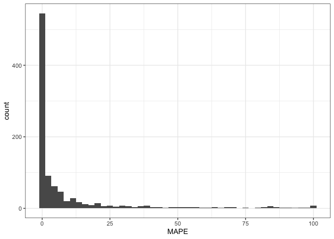

### Packages


```r
library(tidyverse)
```

```
## ── Attaching packages ─────────────────────────────────────── tidyverse 1.3.1 ──
```

```
## ✔ ggplot2 3.3.6     ✔ purrr   0.3.4
## ✔ tibble  3.1.8     ✔ dplyr   1.0.9
## ✔ tidyr   1.2.0     ✔ stringr 1.4.0
## ✔ readr   2.1.2     ✔ forcats 0.5.1
```

```
## ── Conflicts ────────────────────────────────────────── tidyverse_conflicts() ──
## ✖ dplyr::filter() masks stats::filter()
## ✖ dplyr::lag()    masks stats::lag()
```

```r
library(readxl)
```

### Reading in data


```r
validity1 <- read_csv("wearable_review_data_validity.csv")
```

```
## Rows: 1672 Columns: 107
## ── Column specification ────────────────────────────────────────────────────────
## Delimiter: ","
## chr (62): Author, Substudy, Setting, Measured, Measure_Unit, Brand, Device, ...
## dbl (44): X1, Year, device_year, age_SD, weight_SD, height_SD, BMI_SD, actua...
## lgl  (1): n_15pctofcrit
## 
## ℹ Use `spec()` to retrieve the full column specification for this data.
## ℹ Specify the column types or set `show_col_types = FALSE` to quiet this message.
```

```r
validity <- select(validity1, 1:37, MPE, MAPE)

write_csv(validity, "validity_over_time.csv")
```

### Reading in data


```r
glimpse(validity)
```

```
## Rows: 1,672
## Columns: 39
## $ X1                 <dbl> 1, 2, 3, 4, 5, 6, 7, 8, 9, 10, 11, 12, 13, 14, 15, …
## $ Author             <chr> "Dooley", "Dooley", "Dooley", "Boudreaux", "Boudrea…
## $ Year               <dbl> 2017, 2017, 2017, 2018, 2018, 2018, 2017, 2017, 201…
## $ Substudy           <chr> "-", "-", "-", "-", "-", "-", "-", "-", "-", "-", "…
## $ Setting            <chr> "Controlled", "Controlled", "Controlled", "Controll…
## $ Measured           <chr> "HR", "HR", "HR", "HR", "HR", "HR", "SC", "SC", "SC…
## $ Measure_Unit       <chr> "bpm", "bpm", "bpm", "bpm", "bpm", "bpm", "steps/10…
## $ Brand              <chr> "Apple", "Apple", "Apple", "Apple", "Apple", "Apple…
## $ Device             <chr> "Watch", "Watch", "Watch", "Watch Series 2", "Watch…
## $ device_name        <chr> "Apple Watch", "Apple Watch", "Apple Watch", "Apple…
## $ device_year        <dbl> 2015, 2015, 2015, 2016, 2016, 2016, 2015, 2015, 201…
## $ Wear_Location      <chr> "Wrist", "Wrist", "Wrist", "Wrist", "Wrist", "Wrist…
## $ Wear_Info          <chr> "wrist, random", "wrist, random", "wrist, random", …
## $ Type               <chr> "full-text", "full-text", "full-text", "full-text",…
## $ `Good?`            <chr> "y", "y", "y", "y", "y", "y", "y", "y", "y", "y", "…
## $ Criterion_Measure  <chr> "Heart rate sensor chest strap (Polar T31)", "Heart…
## $ Criterion_Type     <chr> "chest strap", "chest strap", "chest strap", "ECG",…
## $ Wear_Info_crit     <chr> "chest", "chest", "chest", "upper torso", "upper to…
## $ Wear_Location_crit <chr> "Torso", "Torso", "Torso", "Torso", "Torso", "Torso…
## $ population_n       <chr> "62", "62", "62", "50", "50", "50", "31", "31", "31…
## $ population_m       <chr> "26", "26", "26", "22", "22", "22", "16", "16", "16…
## $ population_f       <chr> "36", "36", "36", "28", "28", "28", "15", "15", "15…
## $ population         <chr> "healthy adults", "healthy adults", "healthy adults…
## $ age_code           <chr> "A", "A", "A", "A", "A", "A", "A", "A", "A", "A", "…
## $ health_code        <chr> "H", "H", "H", "H", "H", "H", "H", "H", "H", "H", "…
## $ age                <chr> "22.55", "22.55", "22.55", "22.71", "22.71", "22.71…
## $ age_SD             <dbl> 4.34, 4.34, 4.34, 2.99, 2.99, 2.99, 12.00, 12.00, 1…
## $ weight             <chr> "72.02", "72.02", "72.02", "67.79", "67.79", "67.79…
## $ weight_SD          <dbl> 18.99, 18.99, 18.99, 14.01, 14.01, 14.01, NA, NA, N…
## $ height             <chr> "170", "170", "170", "162.71", "162.71", "162.71", …
## $ height_SD          <dbl> 11.00, 11.00, 11.00, 5.79, 5.79, 5.79, NA, NA, NA, …
## $ BMI                <chr> "24.6", "24.6", "24.6", "25.83", "25.83", "25.83", …
## $ BMI_SD             <dbl> 4.77, 4.77, 4.77, 4.83, 4.83, 4.83, 2.40, 2.40, 2.4…
## $ location           <chr> "TX, USA", "TX, USA", "TX, USA", "LA, USA", "LA, US…
## $ activity_type      <chr> "Rest: Seated", "Rest: Seated", "Rest: Seated", "Re…
## $ test_type          <chr> "Rest", "Rest", "Rest", "Rest", "Rest", "Activity",…
## $ activity_type_code <chr> "Se", "Se", "Se", "Se", "Se", "Mi", "At", "At", "At…
## $ MPE                <dbl> 0.007190265, 0.001096041, -0.005327335, NA, NA, NA,…
## $ MAPE               <dbl> 0.0276, 0.0163, 0.0114, 0.0121, 0.0144, 0.0299, 0.0…
```


### Removing Xiaomi and Mio (only one year of devices)


```r
validity <- subset(validity, Brand != "Mio" & Brand != "Xiaomi")
```


### Filtering the data for SC


```r
clean_data <- subset(validity, Measured != "EE" & Measured != "HR")
```


### Number of SC validity tests conducted within each brand


```r
table(clean_data$Brand)
```

```
## 
##    Apple   Fitbit   Garmin   Misfit    Polar  Samsung Withings 
##       31      673      169       42       42       15       84
```

There are 7 different brands of commercial wearable devices included in this study. They are: Apple (31 validity tests), Fitbit (673 validity tests), Garmin (169 validity tests), Misfit (42 validity tests), Polar (42 validity tests), Samsung (15 validity tests) and Withings (84 validity tests).

### Number of SC validity tests conducted within each device type per Brand


```r
table(clean_data$device_name)
```

```
## 
##             Apple Watch    Apple Watch Series 2                  Fitbit 
##                      30                       1                       3 
##           Fitbit Charge         Fitbit Charge 2        Fitbit Charge HR 
##                      21                      30                      76 
##          Fitbit Classic             Fitbit Flex            Fitbit Force 
##                      17                     109                       6 
##              Fitbit One            Fitbit Surge            Fitbit Ultra 
##                     160                      18                      39 
##              Fitbit Zip   Garmin Forerunner 235 Garmin Forerunner 405CX 
##                     194                       2                       1 
## Garmin Forerunner 735XT Garmin Forerunner 920XT       Garmin Vivoactive 
##                       3                       6                       6 
##          Garmin Vivofit        Garmin Vivofit 2        Garmin Vivofit 3 
##                      81                      11                       6 
##        Garmin Vivosmart     Garmin Vivosmart HR    Garmin Vivosmart HR+ 
##                      14                      13                      26 
##            Misfit Flash            Misfit Shine              Polar A300 
##                       6                      36                       1 
##              Polar A360            Polar Active              Polar Loop 
##                       6                       6                      27 
##              Polar M600              Polar V800          Samsung Gear 2 
##                       1                       1                       4 
##          Samsung Gear S         Samsung Gear S2         Samsung Gear S3 
##                       7                       3                       1 
##       Withings Pulse O2       Withings Pulse Ox 
##                      50                      34
```

There are multiple of device types within each brand that were tested for step count validity. Apple has two device types tested: Apple Watch (30 validity tests) and Apple Watch Series 2 (1 validity test). Fitbit has 11 device types: Fitbit (3), Fitbit Charge (21), Fitbit Charge 2 (30), Fitbit Charge HR (76), Fitbit Classic (17), Fitbit Flex (109), Fitbit Force (6), Fitbit One (160), Fitbit Surge (18), Fitbit Ultra (39), Fitbit Zip (194). Garmin has 11 device types: Garmin Forerunner 235 (2), Garmin Forerunner 405CX (1), Garmin Forerunner 735XT (3), Garmin Forerunner 920XT (6), Garmin Vivoactive (6), Garmin Vivofit (81), Garmin Vivofit 2 (11), Garmin Vivofit 3 (6), Garmin Vivosmart (14), Garmin Vivosmart HR (13) and Garmin Vivosmart HR+ (26). Misfit has two device types: Misfit Flash (6) and Misfit Shine (36). Polar has 6 device types: Polar A300 (1), Polar A360 (6), Polar Active (6), Polar Loop (27), Polar M600 (1) and Polar V800 (1). Samsung has 4 device types: Samsung Gear 2 (4), Samsung Gear S (7), Samsung Gear S2 (3) and Samsung Gear S3 (1). Withings has 2 device types: Withings Pulse O2 (50) and Withings Pulse Ox (34).


### Number of devices tested for step count per brand and year of release


```r
table(clean_data$Brand, clean_data$device_year)
```

```
##           
##            2008 2009 2011 2012 2013 2014 2015 2016
##   Apple       0    0    0    0    0    0   30    1
##   Fitbit     17    0   39  160  309   21   94   30
##   Garmin      0    1    0    0    0  101   32   35
##   Misfit      0    0    0   36    0    0    6    0
##   Polar       0    0    6    0   27    1    7    1
##   Samsung     0    0    0    0    0   11    3    1
##   Withings    0    0    0    0   50   34    0    0
```

```r
histo_device_year_Brand <- ggplot(data = clean_data, aes(device_year)) +
        geom_histogram() +
        facet_wrap(~ Brand)

plot(histo_device_year_Brand)
```

```
## `stat_bin()` using `bins = 30`. Pick better value with `binwidth`.
```

```
## Warning: Removed 3 rows containing non-finite values (stat_bin).
```

<!-- -->


### Summary of Mean Absolute Percentage Error for SC of all brands


```r
summary(clean_data$MAPE)
```

```
##    Min. 1st Qu.  Median    Mean 3rd Qu.    Max.    NA's 
##  0.0000  0.0250  0.0685  0.1825  0.1723  5.9590     684
```

```r
histo_MAPE_SC <- ggplot(data = clean_data, aes(MAPE)) +
        geom_histogram(bins = 45)

plot(histo_MAPE_SC)
```

```
## Warning: Removed 684 rows containing non-finite values (stat_bin).
```

<!-- -->

The histogram indicates that the MAPE values are not normally distributed and that there is an extreme positive skewness. Majority of the MAPE values lie to the left of the distribution. The mean is likely not be a good measure of central tendency for this data because of the degree of skewness seen in the histogram. Therefore, we will want to use the median value instead.


### Scatter plot for SC MAPE for all brands compared to device years of release


```r
scatter_MAPE_year_SC <- ggplot(data = clean_data, aes(x = device_year, y = MAPE)) +
      geom_point(alpha = 0.2) +
      stat_smooth(method = "lm", colour = "red") + 
      stat_smooth()

plot(scatter_MAPE_year_SC)
```

```
## `geom_smooth()` using formula 'y ~ x'
```

```
## Warning: Removed 684 rows containing non-finite values (stat_smooth).
```

```
## `geom_smooth()` using method = 'gam' and formula 'y ~ s(x, bs = "cs")'
```

```
## Warning: Removed 684 rows containing non-finite values (stat_smooth).
```

```
## Warning: Computation failed in `stat_smooth()`:
## x has insufficient unique values to support 10 knots: reduce k.
```

```
## Warning: Removed 684 rows containing missing values (geom_point).
```

<!-- -->

As seen in the above scatter plot, as time (device year of release) increases, the Mean Absolute Percentage Error of Step Count measurement increases. MAPE is representative of accuracy, therefore the accuracy for these commercial wearable devices to measure step count decreases over time. 


### Scatter plot for SC MAPE per brand compared to device years of release


```r
scatter_MAPE_year_Brand <- ggplot(data = clean_data, aes(x = device_year, y = MAPE)) +
      geom_point(alpha = 0.2) +
      stat_smooth(method = "lm", colour = "red") +
      facet_wrap(~ Brand)

plot(scatter_MAPE_year_Brand)
```

```
## `geom_smooth()` using formula 'y ~ x'
```

```
## Warning: Removed 684 rows containing non-finite values (stat_smooth).
```

```
## Warning: Removed 684 rows containing missing values (geom_point).
```

<!-- -->

As seen in the above figure, the accuracy of wearable devices to measure step count varies by brand. Of the validity tests conducted using Apple devices, there was a decrease in MAPE values between devices released in 2015 and 2016. This indicates that the accuracy of Apple devices increased with the release of a newer version of wearable technology. When analyzing the data for the brand Fitbit, it can be seen that there was an increased in MAPE values between devices released from 2011-2016. This indicates that the accuracy of Fitbit devices decreased with the release of newer versions of wearable technology. A similar trend was seen in Garmin devices released between the years of 2009-2016. The step count accuracy of these devices decreased as well. The brands Misfit and Polar show increases in accuracy in devices released from 2012-2015 and 2013-2015, respectively. Samsung and Withings show decreases in accuracy in devices released from 2014-2016 ans 2013-2014, respectively. 


## Linear Regression: Device year as a predictor of Step Count MAPE


```r
lm_year_MAPE <- lm(MAPE ~ device_year, data = clean_data)

summary(lm_year_MAPE)
```

```
## 
## Call:
## lm(formula = MAPE ~ device_year, data = clean_data)
## 
## Residuals:
##     Min      1Q  Median      3Q     Max 
## -0.2993 -0.1463 -0.0800  0.0113  5.6883 
## 
## Coefficients:
##               Estimate Std. Error t value Pr(>|t|)    
## (Intercept) -120.45473   32.44069  -3.713 0.000236 ***
## device_year    0.05991    0.01611   3.719 0.000231 ***
## ---
## Signif. codes:  0 '***' 0.001 '**' 0.01 '*' 0.05 '.' 0.1 ' ' 1
## 
## Residual standard error: 0.4438 on 370 degrees of freedom
##   (684 observations deleted due to missingness)
## Multiple R-squared:  0.03603,	Adjusted R-squared:  0.03342 
## F-statistic: 13.83 on 1 and 370 DF,  p-value: 0.0002313
```

### Linear Regression: Analyzing SC MAPE with Brand as a predictor


```r
lm_Brand_MAPE <- lm(MAPE ~ Brand, data = clean_data)


summary(lm_Brand_MAPE)
```

```
## 
## Call:
## lm(formula = MAPE ~ Brand, data = clean_data)
## 
## Residuals:
##     Min      1Q  Median      3Q     Max 
## -0.5278 -0.1491 -0.0953  0.0072  5.7881 
## 
## Coefficients:
##               Estimate Std. Error t value Pr(>|t|)    
## (Intercept)     0.5278     0.1245   4.239 2.84e-05 ***
## BrandFitbit    -0.3569     0.1283  -2.781  0.00570 ** 
## BrandGarmin    -0.3672     0.1373  -2.674  0.00783 ** 
## BrandMisfit    -0.4219     0.1546  -2.730  0.00665 ** 
## BrandPolar     -0.3757     0.1570  -2.393  0.01722 *  
## BrandSamsung   -0.4695     0.2104  -2.231  0.02628 *  
## BrandWithings  -0.2763     0.1442  -1.915  0.05621 .  
## ---
## Signif. codes:  0 '***' 0.001 '**' 0.01 '*' 0.05 '.' 0.1 ' ' 1
## 
## Residual standard error: 0.4489 on 365 degrees of freedom
##   (684 observations deleted due to missingness)
## Multiple R-squared:  0.02721,	Adjusted R-squared:  0.01122 
## F-statistic: 1.702 on 6 and 365 DF,  p-value: 0.1195
```

### Linear Regression: Analyzing differences in SC MAPE with device year and brand as factors


```r
lm_year_Brand_MAPE <- lm(MAPE ~ device_year*Brand, data = clean_data)


summary(lm_year_Brand_MAPE)
```

```
## 
## Call:
## lm(formula = MAPE ~ device_year * Brand, data = clean_data)
## 
## Residuals:
##     Min      1Q  Median      3Q     Max 
## -0.5367 -0.1400 -0.0431  0.0151  5.6837 
## 
## Coefficients:
##                             Estimate Std. Error t value Pr(>|t|)
## (Intercept)                2.358e+02  9.192e+02   0.256    0.798
## device_year               -1.167e-01  4.562e-01  -0.256    0.798
## BrandFitbit               -3.541e+02  9.201e+02  -0.385    0.701
## BrandGarmin               -3.912e+02  9.247e+02  -0.423    0.673
## BrandMisfit               -2.315e+02  9.296e+02  -0.249    0.803
## BrandPolar                -1.518e+02  9.757e+02  -0.156    0.876
## BrandSamsung              -4.140e+02  1.036e+03  -0.400    0.690
## BrandWithings             -1.305e+03  9.639e+02  -1.354    0.177
## device_year:BrandFitbit    1.756e-01  4.566e-01   0.385    0.701
## device_year:BrandGarmin    1.940e-01  4.589e-01   0.423    0.673
## device_year:BrandMisfit    1.147e-01  4.613e-01   0.249    0.804
## device_year:BrandPolar     7.509e-02  4.843e-01   0.155    0.877
## device_year:BrandSamsung   2.052e-01  5.139e-01   0.399    0.690
## device_year:BrandWithings  6.481e-01  4.784e-01   1.355    0.176
## 
## Residual standard error: 0.4383 on 358 degrees of freedom
##   (684 observations deleted due to missingness)
## Multiple R-squared:  0.09027,	Adjusted R-squared:  0.05724 
## F-statistic: 2.733 on 13 and 358 DF,  p-value: 0.001052
```


